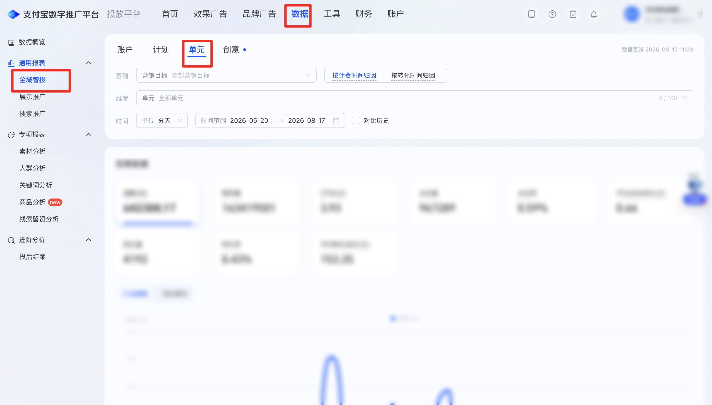
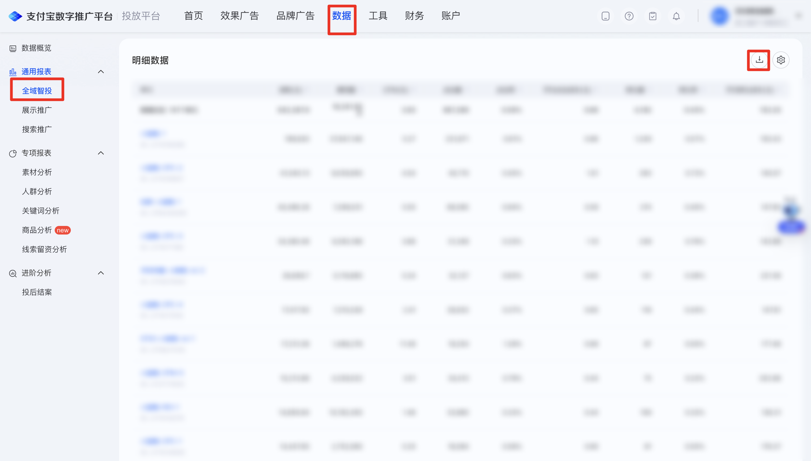

| 属性             | 值                                                         |
| ---------------- | ---------------------------------------------------------- |
| **连接器类型**   | `RPA 连接器`                                               |
| **连接器名称**   | `ODS_全域智投单元明细报表(支付宝RPA)`                      |
| **连接器代码**   | `rpa.conn.zhifubaotg.tfpt.domain.unit.detail.export`       |
| **操作类型**     | `文件导出`                                                 |
| **目标网页**     | `https://adops.alipay.com/report/intelligent-putin-report` |
| **适用场景**     | 登录支付宝数字推广平台后进入全域智投报表，按可选时间范围经任务中心导出单元分天明细 CSV；明细区暂无数据时直接返回空结果 |
| **数据表名**     | `ods_rpa_zhifubaotg_tfpt_domain_unit_detail_export_du`     |
| **业务表名**     | `ODS_全域智投单元明细报表(支付宝RPA)`                      |

### 目标页面

> **取数路径**：支付宝数字推广平台—数据—通用报表—全域智投—单元—明细数据（设置筛选后若明细区显示「暂无数据」则直接返回空结果，不再进入任务中心；有数据时下载任务中心导出的 CSV）
>
> **取数链接**：[https://adops.alipay.com/report/intelligent-putin-report](https://adops.alipay.com/report/intelligent-putin-report)





### 业务入参

| 字段 | 中文释义 | 数据类型 | 必填 | 默认值 | 说明 |
| ---- | -------- | -------- | ---- | ------ | ---- |
| `express_date` | 日期类型 | `String` | 否 | — | 不传则跳过点选，读取页面默认起止日。与 `custom_start_date` / `custom_end_date` 同时传入时以本字段为准，忽略自定义日期且不报错。可选值：`TODAY`（今日）/ `YESTERDAY`（昨日）/ `LAST_7_DAYS`（近7日）/ `LAST_30_DAYS`（近30日）/ `LAST_90_DAYS`（近90日）/ `CUSTOM`（自定义） |
| `custom_start_date` | 自定义起始日期 | `String` | 条件必填 | — | 仅 `express_date` 为空或 `CUSTOM` 时生效。须与 `custom_end_date` 成对传入。格式：`YYYYMMDD` 或 `YYYY-MM-DD`；不得晚于结束日 |
| `custom_end_date` | 自定义结束日期 | `String` | 条件必填 | — | 仅 `express_date` 为空或 `CUSTOM` 时生效。须与 `custom_start_date` 成对传入。格式：`YYYYMMDD` 或 `YYYY-MM-DD`；不得晚于今天；起止跨度不超过 90 天（含起止日） |

### 入参样例

快捷项（近 90 日）：

```json
{
  "express_date": "LAST_90_DAYS"
}
```

快捷项与自定义日期同时传入（以快捷项为准）：

```json
{
  "express_date": "LAST_90_DAYS",
  "custom_start_date": "20260516",
  "custom_end_date": "2026-08-13"
}
```

仅自定义日期：

```json
{
  "custom_start_date": "20260520",
  "custom_end_date": "2026-08-17"
}
```

不传日期，使用页面当前区间：

```json
{}
```

### 入参校验

```json-schema collapsed
{
  "$schema": "https://json-schema.org/draft/2020-12/schema",
  "title": "支付宝数字推广平台-全域智投单元分天明细导出 - 查询入参",
  "description": "登录支付宝数字推广平台后进入全域智投报表，按可选时间范围经任务中心导出单元分天明细 CSV；明细区暂无数据时直接返回空结果",
  "type": "object",
  "properties": {
    "express_date": {
      "type": "string",
      "enum": ["TODAY", "YESTERDAY", "LAST_7_DAYS", "LAST_30_DAYS", "LAST_90_DAYS", "CUSTOM", ""],
      "description": "日期类型；空字符串视为未传。与自定义日期同时传入时以本字段为准。可选值：TODAY（今日）/ YESTERDAY（昨日）/ LAST_7_DAYS（近7日）/ LAST_30_DAYS（近30日）/ LAST_90_DAYS（近90日）/ CUSTOM（自定义）"
    },
    "custom_start_date": {
      "type": "string",
      "description": "自定义起始日期，YYYYMMDD 或 YYYY-MM-DD；空字符串视为未传。仅 express_date 为空或 CUSTOM 时生效，须与 custom_end_date 成对",
      "anyOf": [
        { "const": "" },
        { "pattern": "^\\d{8}$" },
        { "pattern": "^\\d{4}-\\d{2}-\\d{2}$" }
      ]
    },
    "custom_end_date": {
      "type": "string",
      "description": "自定义结束日期，YYYYMMDD 或 YYYY-MM-DD；空字符串视为未传。仅 express_date 为空或 CUSTOM 时生效，须与 custom_start_date 成对；不得晚于今天，跨度不超过 90 天",
      "anyOf": [
        { "const": "" },
        { "pattern": "^\\d{8}$" },
        { "pattern": "^\\d{4}-\\d{2}-\\d{2}$" }
      ]
    }
  },
  "required": [],
  "additionalProperties": false,
  "allOf": [
    {
      "if": {
        "properties": {
          "express_date": { "const": "CUSTOM" }
        },
        "required": ["express_date"]
      },
      "then": {
        "required": ["custom_start_date", "custom_end_date"],
        "properties": {
          "custom_start_date": { "type": "string", "minLength": 1 },
          "custom_end_date": { "type": "string", "minLength": 1 }
        }
      }
    },
    {
      "if": {
        "anyOf": [
          { "not": { "required": ["express_date"] } },
          {
            "properties": {
              "express_date": { "enum": [""] }
            }
          }
        ]
      },
      "then": {
        "dependentRequired": {
          "custom_start_date": ["custom_end_date"],
          "custom_end_date": ["custom_start_date"]
        }
      }
    }
  ]
}
```

### 数据字段

| 字段 | 中文释义 | 数据类型 | 可为空 | 取数路径 | 示例 |
| ---- | -------- | -------- | ------ | -------- | ---- |
| `date` | 日期 | `String` | 是 | `CSV.0.日期` | 2026-08-17 |
| `unitName` | 单元 | `String` | 是 | `CSV.0.单元` | `***-CPC-1` (已脱敏) |
| `unitId` | 单元 ID | `Number` | 是 | `CSV.0.单元ID` | `271****858` (已脱敏) |
| `planName` | 计划 | `String` | 是 | `CSV.0.计划` | `***-CPC-1-8月拉新` (已脱敏) |
| `planId` | 计划 ID | `Number` | 是 | `CSV.0.计划ID` | `228****844` (已脱敏) |
| `cost` | 消耗(元) | `Number` | 是 | `CSV.0.消耗(元)` | 403.78 |
| `impression` | 展现量 | `Number` | 是 | `CSV.0.展现量` | 26081 |
| `cpm` | CPM(元) | `Number` | 是 | `CSV.0.CPM(元)` | 15.48 |
| `click` | 点击量 | `Number` | 是 | `CSV.0.点击量` | 359 |
| `ctr` | 点击率 | `String` | 是 | `CSV.0.点击率` | 1.38% |
| `avgClickCost` | 平均点击成本(元) | `Number` | 是 | `CSV.0.平均点击成本(元)` | 1.12 |
| `convert` | 转化量 | `Number` | 是 | `CSV.0.转化量` | 3 |
| `cvr` | 转化率 | `String` | 是 | `CSV.0.转化率` | 0.84% |
| `avgConvertCost` | 平均转化成本(元) | `Number` | 是 | `CSV.0.平均转化成本(元)` | 134.6 |
| `taobaoShopJoin` | 淘系店铺入会 | `Number` | 是 | `CSV.0.淘系店铺入会` | 0.0 |
| `appWakeSuccess` | APP唤端成功（客户端事件回传） | `Number` | 是 | `CSV.0.APP唤端成功（客户端事件回传）` | 0.0 |
| `tradeAmountPid` | 交易金额-收款账号PID | `Number` | 是 | `CSV.0.交易金额-收款账号PID` | 929.2 |
| `tradeAmountPid3d` | 交易金额-收款账号PID(3天) | `Number` | 是 | `CSV.0.交易金额-收款账号PID(3天)` | 929.2 |
| `tradeAmountPid7d` | 交易金额-收款账号PID(7天) | `Number` | 是 | `CSV.0.交易金额-收款账号PID(7天)` | 929.2 |
| `tradeCountPid` | 交易笔数-收款账号PID | `Number` | 是 | `CSV.0.交易笔数-收款账号PID` | 3.0 |
| `tradeCountPid3d` | 交易笔数-收款账号PID(3天) | `Number` | 是 | `CSV.0.交易笔数-收款账号PID(3天)` | 3.0 |
| `tradeCountPid7d` | 交易笔数-收款账号PID(7天) | `Number` | 是 | `CSV.0.交易笔数-收款账号PID(7天)` | 3.0 |
| `tradeAmountPidExcludeLow` | 交易金额-收款账号PID(排除低客单) | `Number` | 是 | `CSV.0.交易金额-收款账号PID(排除低客单)` | 929.2 |
| `tradeAmountPidExcludeLow7d` | 交易金额-收款账号PID(排除低客单)(7天) | `Number` | 是 | `CSV.0.交易金额-收款账号PID(排除低客单)(7天)` | 929.2 |
| `tradeCountPidExcludeLow` | 交易笔数-收款账号PID(排除低客单) | `Number` | 是 | `CSV.0.交易笔数-收款账号PID(排除低客单)` | 3.0 |
| `tradeCountPidExcludeLow7d` | 交易笔数-收款账号PID(排除低客单)(7天) | `Number` | 是 | `CSV.0.交易笔数-收款账号PID(排除低客单)(7天)` | 3.0 |
| `leadPromote` | 留资推广 | `Number` | 是 | `CSV.0.留资推广` | 0.0 |
| `customStartDate` | 页面起始日期 | `String` | 否 | 页面筛选项回读 | 2026-05-20 |
| `customEndDate` | 页面结束日期 | `String` | 否 | 页面筛选项回读 | 2026-08-17 |
| `bizDate` | 业务日期 | `String` | 否 | 附加 | 20260817 |
| `accountId` | 授权 ID | `String` | 否 | 附加 | `1****4` (已脱敏) |

### 数据样例

```json
[
  {
    "date": "2026-08-17",
    "unitName": "***-CPC-1",
    "unitId": "271****858",
    "planName": "***-CPC-1-8月拉新",
    "planId": "228****844",
    "cost": 403.78,
    "impression": 26081,
    "cpm": 15.48,
    "click": 359,
    "ctr": "1.38%",
    "avgClickCost": 1.12,
    "convert": 3,
    "cvr": "0.84%",
    "avgConvertCost": 134.6,
    "taobaoShopJoin": 0.0,
    "appWakeSuccess": 0.0,
    "tradeAmountPid": 929.2,
    "tradeAmountPid3d": 929.2,
    "tradeAmountPid7d": 929.2,
    "tradeCountPid": 3.0,
    "tradeCountPid3d": 3.0,
    "tradeCountPid7d": 3.0,
    "tradeAmountPidExcludeLow": 929.2,
    "tradeAmountPidExcludeLow7d": 929.2,
    "tradeCountPidExcludeLow": 3.0,
    "tradeCountPidExcludeLow7d": 3.0,
    "leadPromote": 0.0,
    "customStartDate": "2026-05-20",
    "customEndDate": "2026-08-17",
    "bizDate": "20260817",
    "accountId": "1****4"
  }
]
```

---
