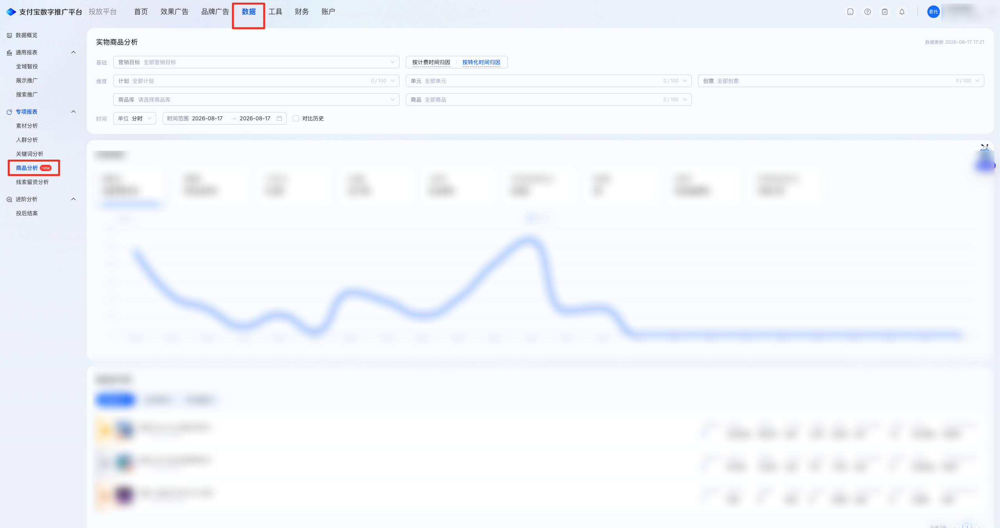
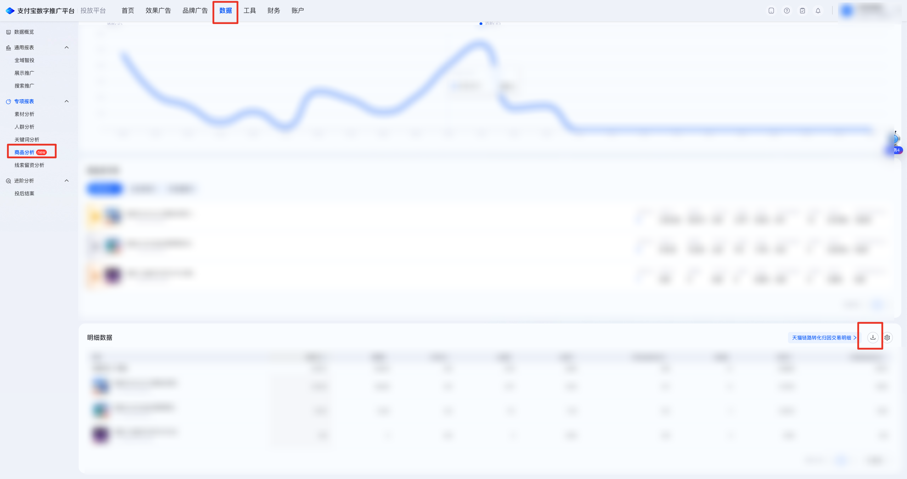

| 属性             | 值                                                                 |
| ---------------- | ------------------------------------------------------------------ |
| **连接器类型**   | `RPA 连接器`                                                       |
| **连接器名称**   | `ODS_商品分析实物明细报表(支付宝RPA)`                              |
| **连接器代码**   | `rpa.conn.zhifubaotg.tfpt.item.entity.export`                      |
| **操作类型**     | `文件导出`                                                         |
| **目标网页**     | `https://adops.alipay.com/report/commodity-analysis/list/physical` |
| **适用场景**     | 登录支付宝数字推广平台后进入实物商品分析页，按必选营销目标与时间单位、可选归因与时间范围经任务中心导出实体明细 CSV |
| **数据表名**     | `ods_rpa_zhifubaotg_tfpt_item_entity_export_du`                    |
| **业务表名**     | `ODS_商品分析实物明细报表(支付宝RPA)`                              |

### 目标页面

> **取数路径**：支付宝数字推广平台—数据—专项报表—商品分析—实物商品分析—明细数据
>
> **取数链接**：[https://adops.alipay.com/report/commodity-analysis/list/physical](https://adops.alipay.com/report/commodity-analysis/list/physical)





### 业务入参

| 字段 | 中文释义 | 数据类型 | 必填 | 默认值 | 说明 |
| ---- | -------- | -------- | ---- | ------ | ---- |
| `marketing_goal` | 营销目标 | `String` | 是 | — | 营销目标搜索关键字。页面按名称/ID 搜索，0 条命中报错，≥1 条点选第一项 |
| `time_unit` | 时间单位 | `String` | 是 | — | 可选值：`HOUR`（分时）/ `DAY`（分天）。`HOUR` 时不支持 `LAST_30_DAYS` / `LAST_90_DAYS`，自定义跨度不超过 7 天 |
| `attribution_type` | 归因类型 | `String` | 否 | — | 不传则跳过点选，保留页面当前归因。可选值：`BILLING_TIME`（按计费时间归因）/ `CONVERSION_TIME`（按转化时间归因） |
| `express_date` | 日期类型 | `String` | 否 | — | 不传且未传自定义日期则跳过点选，读取页面默认起止日。只传自定义日期、未传本字段时视为 `CUSTOM`。与自定义日期同时传入快捷项时，自定义日期须等于该快捷项对应区间，否则报错。可选值：`TODAY`（今日）/ `YESTERDAY`（昨日）/ `LAST_7_DAYS`（近7日）/ `LAST_30_DAYS`（近30日）/ `LAST_90_DAYS`（近90日）/ `CUSTOM`（自定义） |
| `custom_start_date` | 自定义起始日期 | `String` | 条件必填 | — | `express_date=CUSTOM` 时必填；与 `custom_end_date` 须成对传入。格式：`YYYYMMDD` 或 `YYYY-MM-DD`；不得晚于结束日 |
| `custom_end_date` | 自定义结束日期 | `String` | 条件必填 | — | `express_date=CUSTOM` 时必填；与 `custom_start_date` 须成对传入。格式：`YYYYMMDD` 或 `YYYY-MM-DD`；不得晚于今天；`DAY` 跨度不超过 90 天、`HOUR` 跨度不超过 7 天（均含起止日） |

### 入参样例

分天 + 近 7 日 + 按转化时间归因（常用）：

```json
{
  "marketing_goal": "电商",
  "time_unit": "DAY",
  "attribution_type": "CONVERSION_TIME",
  "express_date": "LAST_7_DAYS"
}
```

分时 + 今日：

```json
{
  "marketing_goal": "电商",
  "time_unit": "HOUR",
  "express_date": "TODAY"
}
```

自定义日期：

```json
{
  "marketing_goal": "电商",
  "time_unit": "DAY",
  "express_date": "CUSTOM",
  "custom_start_date": "20260801",
  "custom_end_date": "2026-08-17"
}
```

仅必填项，使用页面当前日期区间与归因：

```json
{
  "marketing_goal": "电商",
  "time_unit": "DAY"
}
```

### 入参校验

```json-schema collapsed
{
  "$schema": "https://json-schema.org/draft/2020-12/schema",
  "title": "支付宝数字推广平台-实物商品分析实体明细导出 - 查询入参",
  "description": "登录支付宝数字推广平台后进入实物商品分析页，按必选营销目标与时间单位、可选归因与时间范围经任务中心导出实体明细 CSV",
  "type": "object",
  "properties": {
    "marketing_goal": {
      "type": "string",
      "minLength": 1,
      "description": "营销目标搜索关键字。页面按名称/ID 搜索，0 条命中报错，≥1 条点选第一项"
    },
    "time_unit": {
      "type": "string",
      "enum": ["HOUR", "DAY"],
      "description": "时间单位。可选值：HOUR（分时）/ DAY（分天）。HOUR 时不支持 LAST_30_DAYS / LAST_90_DAYS，自定义跨度不超过 7 天"
    },
    "attribution_type": {
      "type": "string",
      "enum": ["BILLING_TIME", "CONVERSION_TIME", ""],
      "description": "归因类型；空字符串视为未传，跳过点选。可选值：BILLING_TIME（按计费时间归因）/ CONVERSION_TIME（按转化时间归因）"
    },
    "express_date": {
      "type": "string",
      "enum": ["TODAY", "YESTERDAY", "LAST_7_DAYS", "LAST_30_DAYS", "LAST_90_DAYS", "CUSTOM", ""],
      "description": "日期类型；空字符串视为未传。不传且未传自定义日期则读取页面默认起止日。只传自定义日期时视为 CUSTOM。与自定义日期同时传入快捷项时，自定义日期须等于该快捷项区间。可选值：TODAY（今日）/ YESTERDAY（昨日）/ LAST_7_DAYS（近7日）/ LAST_30_DAYS（近30日）/ LAST_90_DAYS（近90日）/ CUSTOM（自定义）"
    },
    "custom_start_date": {
      "type": "string",
      "description": "自定义起始日期，YYYYMMDD 或 YYYY-MM-DD；空字符串视为未传。express_date=CUSTOM 时必填，须与 custom_end_date 成对",
      "anyOf": [
        { "const": "" },
        { "pattern": "^\\d{8}$" },
        { "pattern": "^\\d{4}-\\d{2}-\\d{2}$" }
      ]
    },
    "custom_end_date": {
      "type": "string",
      "description": "自定义结束日期，YYYYMMDD 或 YYYY-MM-DD；空字符串视为未传。express_date=CUSTOM 时必填，须与 custom_start_date 成对；不得晚于今天；DAY 跨度不超过 90 天、HOUR 跨度不超过 7 天",
      "anyOf": [
        { "const": "" },
        { "pattern": "^\\d{8}$" },
        { "pattern": "^\\d{4}-\\d{2}-\\d{2}$" }
      ]
    }
  },
  "required": ["marketing_goal", "time_unit"],
  "additionalProperties": false,
  "allOf": [
    {
      "if": {
        "properties": {
          "express_date": { "const": "CUSTOM" }
        },
        "required": ["express_date"]
      },
      "then": {
        "required": ["custom_start_date", "custom_end_date"],
        "properties": {
          "custom_start_date": { "type": "string", "minLength": 1 },
          "custom_end_date": { "type": "string", "minLength": 1 }
        }
      }
    },
    {
      "if": {
        "anyOf": [
          { "not": { "required": ["express_date"] } },
          {
            "properties": {
              "express_date": { "enum": [""] }
            }
          }
        ]
      },
      "then": {
        "dependentRequired": {
          "custom_start_date": ["custom_end_date"],
          "custom_end_date": ["custom_start_date"]
        }
      }
    },
    {
      "if": {
        "properties": {
          "time_unit": { "const": "HOUR" }
        },
        "required": ["time_unit"]
      },
      "then": {
        "properties": {
          "express_date": {
            "enum": ["TODAY", "YESTERDAY", "LAST_7_DAYS", "CUSTOM", ""]
          }
        }
      }
    }
  ]
}
```

### 数据字段

| 字段 | 中文释义 | 数据类型 | 可为空 | 取数路径 | 示例 |
| ---- | -------- | -------- | ------ | -------- | ---- |
| `date` | 日期 | `String` | 是 | `CSV.0.日期` | — |
| `itemNo` | 商品No | `String` | 是 | `CSV.0.商品No` | — |
| `itemName` | 商品名称 | `String` | 是 | `CSV.0.商品名称` | — |
| `marketingGoalCode` | 营销目标code | `String` | 是 | `CSV.0.营销目标code` | — |
| `marketingGoalName` | 营销目标名称 | `String` | 是 | `CSV.0.营销目标名称` | — |
| `planId` | 计划ID | `Number` | 是 | `CSV.0.计划ID` | — |
| `planName` | 计划名称 | `String` | 是 | `CSV.0.计划名称` | — |
| `unitId` | 单元ID | `Number` | 是 | `CSV.0.单元ID` | — |
| `unitName` | 单元名称 | `String` | 是 | `CSV.0.单元名称` | — |
| `creativeId` | 创意ID | `Number` | 是 | `CSV.0.创意ID` | — |
| `creativeName` | 创意名称 | `String` | 是 | `CSV.0.创意名称` | — |
| `itemLibraryId` | 商品库ID | `Number` | 是 | `CSV.0.商品库ID` | — |
| `itemLibraryName` | 商品库名称 | `String` | 是 | `CSV.0.商品库名称` | — |
| `cost` | 消耗(元) | `Number` | 是 | `CSV.0.消耗(元)` | — |
| `impression` | 展现量 | `Number` | 是 | `CSV.0.展现量` | — |
| `cpm` | CPM(元) | `Number` | 是 | `CSV.0.CPM(元)` | — |
| `click` | 点击量 | `Number` | 是 | `CSV.0.点击量` | — |
| `ctr` | 点击率 | `String` | 是 | `CSV.0.点击率` | — |
| `avgClickCost` | 平均点击成本(元) | `Number` | 是 | `CSV.0.平均点击成本(元)` | — |
| `convert` | 转化量 | `Number` | 是 | `CSV.0.转化量` | — |
| `cvr` | 转化率 | `String` | 是 | `CSV.0.转化率` | — |
| `avgConvertCost` | 平均转化成本(元) | `Number` | 是 | `CSV.0.平均转化成本(元)` | — |
| `tradeAmountPid` | 交易金额-收款账号PID | `Number` | 是 | `CSV.0.交易金额-收款账号PID` | — |
| `roiPid` | ROI-收款账号PID | `Number` | 是 | `CSV.0.ROI-收款账号PID` | — |
| `taobaoShopJoin` | 淘系店铺入会 | `Number` | 是 | `CSV.0.淘系店铺入会` | — |
| `appOrderApi15d` | APP内下单(API回传)(15天) | `Number` | 是 | `CSV.0.APP内下单(API回传)(15天)` | — |
| `appOrderAmountAp15d` | APP内下单金额(AP回传)(15天) | `Number` | 是 | `CSV.0.APP内下单金额(AP回传)(15天)` | — |
| `appRefundApi15d` | APP内退款(API回传)(15天) | `Number` | 是 | `CSV.0.APP内退款(API回传)(15天)` | — |
| `appRefundAmountApi15d` | APP内退款金额(API回传)(15天) | `Number` | 是 | `CSV.0.APP内退款金额(API回传)(15天)` | — |
| `dailyGrabMiniPayRoi` | 每日必抢小程序内支付交易ROI | `Number` | 是 | `CSV.0.每日必抢小程序内支付交易ROI` | — |
| `appPayApi15d` | APP内支付(API回传)(15天) | `Number` | 是 | `CSV.0.APP内支付(API回传)(15天)` | — |
| `tradeRoiAggregateSlotId` | 交易ROI-聚合页展位ID | `Number` | 是 | `CSV.0.交易ROI-聚合页展位ID` | — |
| `appWakeSuccess` | APP唤端成功（客户端事件回传） | `Number` | 是 | `CSV.0.APP唤端成功（客户端事件回传）` | — |
| `tradeAmountPid3d` | 交易金额-收款账号PID(3天) | `Number` | 是 | `CSV.0.交易金额-收款账号PID(3天)` | — |
| `tradeAmountPid7d` | 交易金额-收款账号PID(7天) | `Number` | 是 | `CSV.0.交易金额-收款账号PID(7天)` | — |
| `tradeAmountPid15d` | 交易金额-收款账号PID(15天) | `Number` | 是 | `CSV.0.交易金额-收款账号PID(15天)` | — |
| `tradeAmountPid30d` | 交易金额-收款账号PID(30天) | `Number` | 是 | `CSV.0.交易金额-收款账号PID(30天)` | — |
| `tradeCountPid` | 交易笔数-收款账号PID | `Number` | 是 | `CSV.0.交易笔数-收款账号PID` | — |
| `tradeCountPid3d` | 交易笔数-收款账号PID(3天) | `Number` | 是 | `CSV.0.交易笔数-收款账号PID(3天)` | — |
| `tradeCountPid7d` | 交易笔数-收款账号PID(7天) | `Number` | 是 | `CSV.0.交易笔数-收款账号PID(7天)` | — |
| `tradeCountPid15d` | 交易笔数-收款账号PID(15天) | `Number` | 是 | `CSV.0.交易笔数-收款账号PID(15天)` | — |
| `tradeCountPid30d` | 交易笔数-收款账号PID(30天) | `Number` | 是 | `CSV.0.交易笔数-收款账号PID(30天)` | — |
| `roiPid3d` | ROI(3天)-收款账号PID | `Number` | 是 | `CSV.0.ROI(3天)-收款账号PID` | — |
| `roiPid7d` | ROI(7天)-收款账号PID | `Number` | 是 | `CSV.0.ROI(7天)-收款账号PID` | — |
| `roiPid15d` | ROI(15天)-收款账号PID | `Number` | 是 | `CSV.0.ROI(15天)-收款账号PID` | — |
| `tradeAmountPidExcludeLow` | 交易金额-收款账号PID(排除低客单) | `Number` | 是 | `CSV.0.交易金额-收款账号PID(排除低客单)` | — |
| `tradeAmountPidExcludeLow7d` | 交易金额-收款账号PID(排除低客单)(7天) | `Number` | 是 | `CSV.0.交易金额-收款账号PID(排除低客单)(7天)` | — |
| `tradeAmountPidExcludeLow15d` | 交易金额-收款账号PID(排除低客单)(15天) | `Number` | 是 | `CSV.0.交易金额-收款账号PID(排除低客单)(15天)` | — |
| `tradeCountPidExcludeLow` | 交易笔数-收款账号PID(排除低客单) | `Number` | 是 | `CSV.0.交易笔数-收款账号PID(排除低客单)` | — |
| `tradeCountPidExcludeLow7d` | 交易笔数-收款账号PID(排除低客单)(7 天) | `Number` | 是 | `CSV.0.交易笔数-收款账号PID(排除低客单)(7 天)` | — |
| `tradeCountPidExcludeLow15d` | 交易笔数-收款账号PID(排除低客单)(15天) | `Number` | 是 | `CSV.0.交易笔数-收款账号PID(排除低客单)(15天)` | — |
| `roiPidExcludeLow` | ROI-收款账号PID(排除低客单) | `Number` | 是 | `CSV.0.ROI-收款账号PID(排除低客单)` | — |
| `roiPidExcludeLow7d` | ROI(7天)-收款账号PID(排除低客单) | `Number` | 是 | `CSV.0.ROI(7天)-收款账号PID(排除低客单)` | — |
| `roiPidExcludeLow15d` | ROI(15天)-收款账号PID(排除低客单) | `Number` | 是 | `CSV.0.ROI(15天)-收款账号PID(排除低客单)` | — |
| `tradeAmountPidExpo` | 交易金额-收款账号PID(曝光归因) | `Number` | 是 | `CSV.0.交易金额-收款账号PID(曝光归因)` | — |
| `tradeAmountPidExpo3d` | 交易金额(3天)-收款账号PID(曝光归因) | `Number` | 是 | `CSV.0.交易金额(3天)-收款账号PID(曝光归因)` | — |
| `tradeAmountPidExpo7d` | 交易金额(7天)-收款账号PID(曝光归因) | `Number` | 是 | `CSV.0.交易金额(7天)-收款账号PID(曝光归因)` | — |
| `tradeAmountPidExpo15d` | 交易金额(15天)-收款账号PID(曝光归因) | `Number` | 是 | `CSV.0.交易金额(15天)-收款账号PID(曝光归因)` | — |
| `tradeCountPidExpo` | 交易笔数-收款账号PID(曝光归因) | `Number` | 是 | `CSV.0.交易笔数-收款账号PID(曝光归因)` | — |
| `tradeCountPidExpo3d` | 交易笔数(3天)-收款账号PID(曝光归因) | `Number` | 是 | `CSV.0.交易笔数(3天)-收款账号PID(曝光归因)` | — |
| `tradeCountPidExpo7d` | 交易笔数(7天)-收款账号PID(曝光归因) | `Number` | 是 | `CSV.0.交易笔数(7天)-收款账号PID(曝光归因)` | — |
| `tradeCountPidExpo15d` | 交易笔数(15天)-收款账号PID(曝光归因) | `Number` | 是 | `CSV.0.交易笔数(15天)-收款账号PID(曝光归因)` | — |
| `roiPidExpo` | ROI-收款账号PID(曝光归因) | `Number` | 是 | `CSV.0.ROI-收款账号PID(曝光归因)` | — |
| `roiPidExpo3d` | ROI(3天)-收款账号PID(曝光归因) | `Number` | 是 | `CSV.0.ROI(3天)-收款账号PID(曝光归因)` | — |
| `roiPidExpo7d` | ROI(7天)-收款账号PID(曝光归因) | `Number` | 是 | `CSV.0.ROI(7天)-收款账号PID(曝光归因)` | — |
| `roiPidExpo15d` | ROI(15天)-收款账号PID(曝光归因) | `Number` | 是 | `CSV.0.ROI(15天)-收款账号PID(曝光归因)` | — |
| `tradeAmountAlipayOrder15d` | 交易金额(15天)-支付宝账号收款订单 | `Number` | 是 | `CSV.0.交易金额(15天)-支付宝账号收款订单` | — |
| `alipayOrderTradeCount15d` | 支付宝账号收款订单 - 交易笔数(15天) | `Number` | 是 | `CSV.0.支付宝账号收款订单 - 交易笔数(15天)` | — |
| `roiAlipayOrder` | ROI-支付宝收款订单 | `Number` | 是 | `CSV.0.ROI-支付宝收款订单` | — |
| `roiAlipayOrder3d` | ROI(3天)-支付宝收款订单 | `Number` | 是 | `CSV.0.ROI(3天)-支付宝收款订单` | — |
| `roiAlipayOrder7d` | ROI(7天)-支付宝收款订单 | `Number` | 是 | `CSV.0.ROI(7天)-支付宝收款订单` | — |
| `tmallMiniPayAmount15d` | 天猫小程序内支付金额(15天) | `Number` | 是 | `CSV.0.天猫小程序内支付金额(15天)` | — |
| `tmallMiniPayCount15d` | 天猫小程序内支付笔数(15天) | `Number` | 是 | `CSV.0.天猫小程序内支付笔数(15天)` | — |
| `tmallMiniPayRoi` | 天猫小程序内支付交易ROI | `Number` | 是 | `CSV.0.天猫小程序内支付交易ROI` | — |
| `tmallMiniPayRoi7d` | 天猫小程序内支付交易ROI(7天) | `Number` | 是 | `CSV.0.天猫小程序内支付交易ROI(7天)` | — |
| `tmallMiniPayRoi15d` | 天猫小程序内支付交易ROI(15天) | `Number` | 是 | `CSV.0.天猫小程序内支付交易ROI(15天)` | — |
| `leadPromote` | 留资推广 | `Number` | 是 | `CSV.0.留资推广` | — |
| `tradeCountApi15d` | 交易笔数(API回传)(15天) | `Number` | 是 | `CSV.0.交易笔数(API回传)(15天)` | — |
| `customStartDate` | 页面起始日期 | `String` | 否 | 页面筛选项回读 | 2026-08-11 |
| `customEndDate` | 页面结束日期 | `String` | 否 | 页面筛选项回读 | 2026-08-17 |
| `bizDate` | 业务日期 | `String` | 否 | 附加 | 20260817 |
| `accountId` | 授权 ID | `String` | 否 | 附加 | `1****4` (已脱敏) |

### 数据样例

{/* TODO: 数据样例待补充。本次运行输出仅含 82 项字段名（共 3688 行），未提供逐行记录；补充一行真实数据后可回填示例列与本段 JSON */}

---
