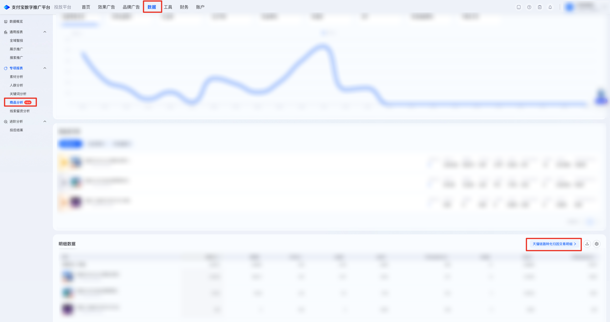

| 属性             | 值                                                                 |
| ---------------- | ------------------------------------------------------------------ |
| **连接器类型**   | `RPA 连接器`                                                       |
| **连接器名称**   | `ODS_商品分析天猫链路转化归因交易明细报表(支付宝RPA)`              |
| **连接器代码**   | `rpa.conn.zhifubaotg.tfpt.item.tmall.conversion.export`            |
| **操作类型**     | `文件导出`                                                         |
| **目标网页**     | `https://adops.alipay.com/report/commodity-analysis/list/physical` |
| **适用场景**     | 登录支付宝数字推广平台后进入实物商品分析页，打开天猫链路转化归因交易明细抽屉，按可选交易日期、交易号、收单 PID 与归因效期经任务中心导出交易明细 CSV；抽屉暂无数据时直接返回空结果 |
| **数据表名**     | `ods_rpa_zhifubaotg_tfpt_item_tmall_conversion_export_du`          |
| **业务表名**     | `ODS_商品分析天猫链路转化归因交易明细报表(支付宝RPA)`              |

### 目标页面

> **取数路径**：支付宝数字推广平台—数据—专项报表—商品分析—实物商品分析—明细数据—天猫链路转化归因交易明细
>
> **取数链接**：[https://adops.alipay.com/report/commodity-analysis/list/physical](https://adops.alipay.com/report/commodity-analysis/list/physical)




### 业务入参

| 字段 | 中文释义 | 数据类型 | 必填 | 默认值 | 说明 |
| ---- | -------- | -------- | ---- | ------ | ---- |
| `custom_start_date` | 自定义起始日期 | `String` | 条件必填 | — | 对应抽屉「交易日期」开始。须与 `custom_end_date` 成对传入；不传则跳过点选，读取页面当前起止日。格式：`YYYYMMDD` 或 `YYYY-MM-DD`；不得晚于结束日 |
| `custom_end_date` | 自定义结束日期 | `String` | 条件必填 | — | 对应抽屉「交易日期」结束。须与 `custom_start_date` 成对传入；不传则跳过点选，读取页面当前起止日。格式：`YYYYMMDD` 或 `YYYY-MM-DD` |
| `trade_no` | 交易号 | `String` | 否 | — | 不传则跳过填写。须为纯数字，长度 25–35 位 |
| `acquire_pid` | 收单 PID | `String` | 否 | — | 不传则跳过填写。须为纯数字，长度 10–20 位 |
| `attribution_period` | 归因效期 | `String` | 否 | — | 不传则跳过点选，读取页面当前值回传。可选值：`ONE_DAY`（1天）/ `THREE_DAYS`（3天）/ `SEVEN_DAYS`（7天） |

### 入参样例

交易日期 + 交易号 + 收单 PID + 归因效期 3 天：

```json
{
  "custom_start_date": "20260801",
  "custom_end_date": "2026-08-15",
  "trade_no": "2026081523001184171423109205",
  "acquire_pid": "2088370856823747",
  "attribution_period": "THREE_DAYS"
}
```

仅自定义交易日期：

```json
{
  "custom_start_date": "20260801",
  "custom_end_date": "2026-08-15"
}
```

不传筛选项，使用抽屉当前值：

```json
{}
```

### 入参校验

```json-schema collapsed
{
  "$schema": "https://json-schema.org/draft/2020-12/schema",
  "title": "支付宝数字推广平台-天猫链路转化归因交易明细导出 - 查询入参",
  "description": "登录支付宝数字推广平台后进入实物商品分析页，打开天猫链路转化归因交易明细抽屉，按可选交易日期、交易号、收单 PID 与归因效期经任务中心导出交易明细 CSV；抽屉暂无数据时直接返回空结果",
  "type": "object",
  "properties": {
    "custom_start_date": {
      "type": "string",
      "description": "自定义起始日期（交易日期开始），YYYYMMDD 或 YYYY-MM-DD；空字符串视为未传。须与 custom_end_date 成对",
      "anyOf": [
        { "const": "" },
        { "pattern": "^\\d{8}$" },
        { "pattern": "^\\d{4}-\\d{2}-\\d{2}$" }
      ]
    },
    "custom_end_date": {
      "type": "string",
      "description": "自定义结束日期（交易日期结束），YYYYMMDD 或 YYYY-MM-DD；空字符串视为未传。须与 custom_start_date 成对",
      "anyOf": [
        { "const": "" },
        { "pattern": "^\\d{8}$" },
        { "pattern": "^\\d{4}-\\d{2}-\\d{2}$" }
      ]
    },
    "trade_no": {
      "type": "string",
      "description": "交易号；空字符串视为未传。须为纯数字，长度 25–35 位",
      "anyOf": [
        { "const": "" },
        { "pattern": "^\\d{25,35}$" }
      ]
    },
    "acquire_pid": {
      "type": "string",
      "description": "收单 PID；空字符串视为未传。须为纯数字，长度 10–20 位",
      "anyOf": [
        { "const": "" },
        { "pattern": "^\\d{10,20}$" }
      ]
    },
    "attribution_period": {
      "type": "string",
      "enum": ["ONE_DAY", "THREE_DAYS", "SEVEN_DAYS", ""],
      "description": "归因效期；空字符串视为未传，读取页面当前值。可选值：ONE_DAY（1天）/ THREE_DAYS（3天）/ SEVEN_DAYS（7天）"
    }
  },
  "required": [],
  "additionalProperties": false,
  "dependentRequired": {
    "custom_start_date": ["custom_end_date"],
    "custom_end_date": ["custom_start_date"]
  }
}
```

### 数据字段

| 字段 | 中文释义 | 数据类型 | 可为空 | 取数路径 | 示例 |
| ---- | -------- | -------- | ------ | -------- | ---- |
| `tradeDate` | 交易日期 | `String` | 是 | `CSV.0.交易日期` | 2026-08-15 |
| `clickDate` | 点击日期 | `String` | 是 | `CSV.0.点击日期` | 2026-08-15 |
| `tradeNo` | 交易号 | `String` | 是 | `CSV.0.交易号` | `202****205` (已脱敏) |
| `tradeAmount` | 交易金额 | `Number` | 是 | `CSV.0.交易金额` | 258.00 |
| `payTime` | 支付时间 | `String` | 是 | `CSV.0.支付时间` | 2026-08-15 14:25:19 |
| `acquirePid` | 收单PID | `String` | 是 | `CSV.0.收单PID` | `208****747` (已脱敏) |
| `convertEvent` | 转化事件 | `String` | 是 | `CSV.0.转化事件` | 交易笔数-收款账号PID |
| `attrPlan` | 归因计划 | `String` | 是 | `CSV.0.归因计划` | `小蓝瓶****月拉新` (已脱敏) |
| `attrPlanId` | 归因计划ID | `Number` | 是 | `CSV.0.归因计划ID` | `228****844` (已脱敏) |
| `itemName` | 投放商品名称 | `String` | 是 | `CSV.0.投放商品名称` | `万益蓝****生菌粉` (已脱敏) |
| `itemId` | 投放商品ID | `Number` | 是 | `CSV.0.投放商品ID` | `619****683` (已脱敏) |
| `attrUnit` | 归因单元 | `String` | 是 | `CSV.0.归因单元` | `小蓝瓶****C-6` (已脱敏) |
| `attrUnitId` | 归因单元ID | `Number` | 是 | `CSV.0.归因单元ID` | `272****811` (已脱敏) |
| `attrCreative` | 归因创意 | `String` | 是 | `CSV.0.归因创意` | `小蓝瓶****6-7` (已脱敏) |
| `attrCreativeId` | 归因创意ID | `Number` | 是 | `CSV.0.归因创意ID` | `390****683` (已脱敏) |
| `customStartDate` | 页面交易起始日期 | `String` | 否 | 页面筛选项回读 | 2026-08-01 |
| `customEndDate` | 页面交易结束日期 | `String` | 否 | 页面筛选项回读 | 2026-08-15 |
| `attributionPeriod` | 页面归因效期 | `String` | 否 | 页面筛选项回读 | THREE_DAYS |
| `filterTradeNo` | 页面交易号筛选值 | `String` | 是 | 传入 `trade_no` 时回读 | `202****205` (已脱敏) |
| `filterAcquirePid` | 页面收单 PID 筛选值 | `String` | 是 | 传入 `acquire_pid` 时回读 | `208****747` (已脱敏) |
| `bizDate` | 业务日期 | `String` | 否 | 附加 | 20260817 |
| `accountId` | 授权 ID | `String` | 否 | 附加 | `1****4` (已脱敏) |

### 数据样例

```json
[
  {
    "tradeDate": "2026-08-15",
    "clickDate": "2026-08-15",
    "tradeNo": "202****205",
    "tradeAmount": 258.00,
    "payTime": "2026-08-15 14:25:19",
    "acquirePid": "208****747",
    "convertEvent": "交易笔数-收款账号PID",
    "attrPlan": "*******月拉新",
    "attrPlanId": "228****844",
    "itemName": "*******生菌粉",
    "itemId": "619****683",
    "attrUnit": "*******C-6",
    "attrUnitId": "272****811",
    "attrCreative": "*******6-7",
    "attrCreativeId": "390****683",
    "customStartDate": "2026-08-01",
    "customEndDate": "2026-08-15",
    "attributionPeriod": "THREE_DAYS",
    "filterTradeNo": "202****205",
    "filterAcquirePid": "208****747",
    "bizDate": "20260817",
    "accountId": "1****4"
  }
]
```

---
