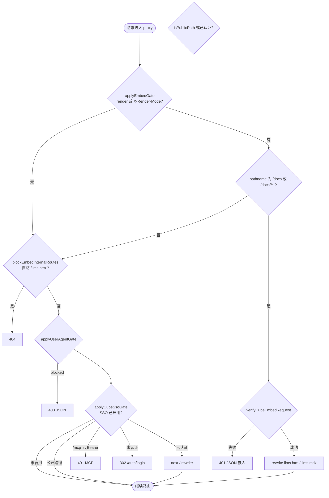
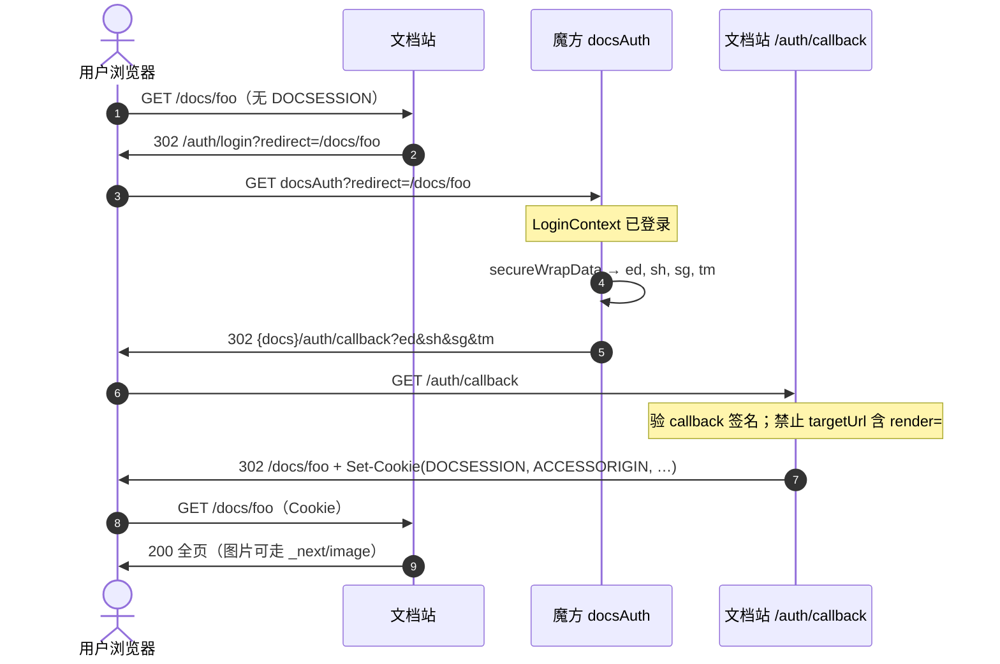
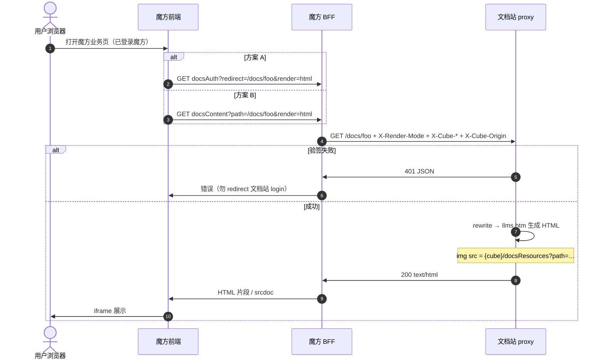
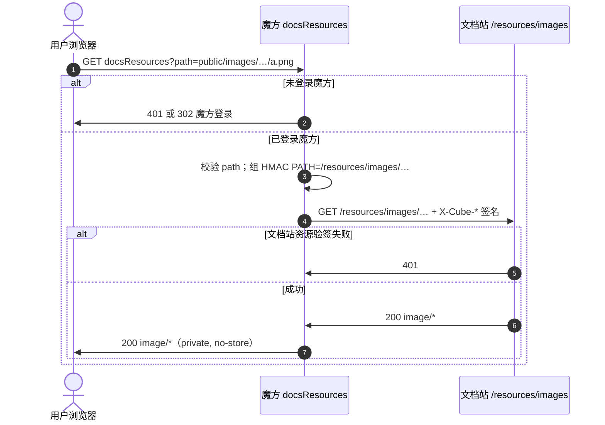
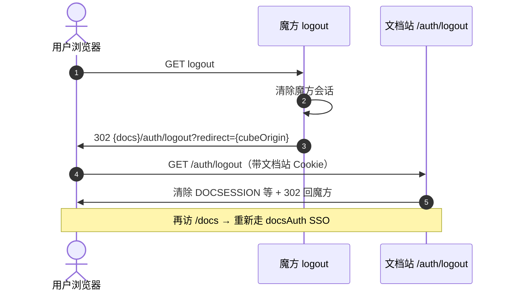
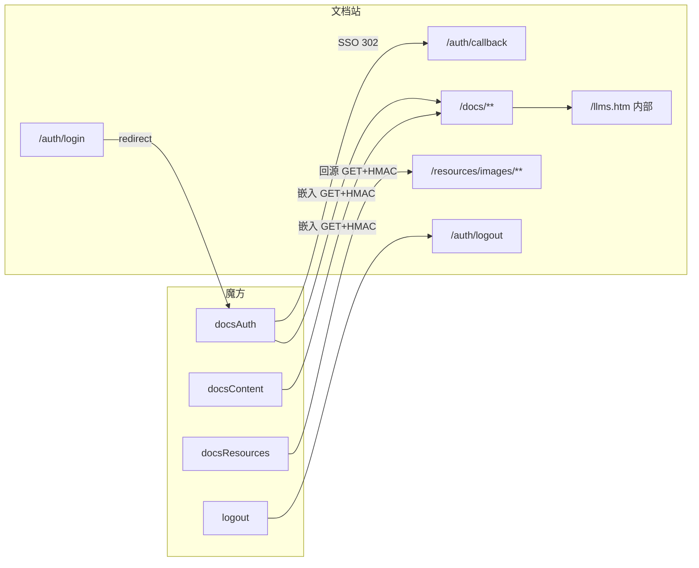

# Cube SSO 与文档站集成说明

魔方（Cube）与 RPA 公共知识库（文档站）的对接契约。本文描述魔方侧 **三个对外接口**、文档站 **门禁顺序**、以及双方 **时序与签名**。

- 本地 Mock：`scripts/mock-cube-docs-auth.py`（路径与生产对齐，无 `/api` 前缀亦可挂载）
- 门禁验收：`scripts/verify-prod-gates.sh`
- 实现入口：[`src/proxy.ts`](../src/proxy.ts)、[`src/lib/auth/cube-embed.ts`](../src/lib/auth/cube-embed.ts)

---

## 1. 职责划分

| 系统 | 职责 |
|------|------|
| **魔方** | 用户登录态；`docsAuth` SSO / 嵌入编排；`docsContent` 专用嵌入（可选）；`docsResources` 图片代理与回源 |
| **文档站** | Cookie 会话（通道 B）；嵌入 HMAC 验签（通道 A）；私有文档 ACL；`/resources/images` 可选二次验签 |

魔方 **BFF 服务端** 访问文档站时携带 HMAC；浏览器访问嵌入页内的图片时访问魔方 `docsResources`（带魔方 Cookie），由魔方再带 HMAC 回源文档站。

---

## 2. 魔方三个接口

生产路径以魔方实际路由为准（常见为 `/api/docsAuth` 等）；下表用 **逻辑名** 描述行为。Mock 见 `scripts/mock-cube-docs-auth.py`。

### 2.1 总览

| 接口 | 通道 | 调用方 | 文档站是否写 Cookie | 典型响应 |
|------|------|--------|---------------------|----------|
| **docsAuth** | B：SSO 全页 | 用户浏览器 | **是**（经 callback） | 302 → 文档站 `/auth/callback` |
| **docsAuth** | A：嵌入（方案 A） | 魔方 BFF | **否** | 200 HTML / Markdown |
| **docsContent** | A：嵌入（方案 B） | 魔方 BFF 或浏览器同源代理 | **否** | 200 HTML / Markdown |
| **docsResources** | A：嵌入图片 | 用户浏览器（iframe 内 img） | **否** | 200 图片二进制 |

**方案 A / B（嵌入拉正文）**：文档站侧处理完全相同（`GET` 文档站 `/docs/...` + 嵌入签名 + `X-Render-Mode`）；魔方仅选择暴露 `docsAuth?render=` 或独立 `docsContent`。

---

### 2.2 `GET docsAuth`

**用途**：统一入口；用 Query **`render`** 区分 SSO 与嵌入。

| Query | 行为 | 魔方前置条件 |
|-------|------|----------------|
| `redirect` | 文档站内路径，必填，须以 `/` 开头 | — |
| `render` 未传 / `redirect` | **通道 B**：`secureWrapData` → 302 文档站 `/auth/callback` | 用户已登录魔方（LoginContext） |
| `render=html` \| `markdown` | **通道 A**：BFF `GET` 文档站对应页，返回正文 | 同上；**禁止**在 SSO 的 `targetUrl` 中带 `render` |

**通道 B — 302 目标（文档站）**

```
GET {docs}/auth/callback?ed={base64}&sh={hex}&sg={hex}&tm={ms}
```

**通道 A — 文档站请求（BFF → 文档站）**

```
GET {docs}{redirect}?render=...   # 仅调试；生产推荐 Header 传参
GET {docs}{redirect}
  X-Render-Mode: html | markdown
  X-Cube-Secret-Hash / X-Cube-Timestamp / X-Cube-Signature
  X-Cube-Origin: {cube 根 URL}    # 必填，用于 HTML 内图片代理基址
  X-Cube-User: {可选}
```

文档站 [`verifyCubeEmbedRequest`](../src/lib/auth/cube-embed.ts) 验签 **`PATH` = `/docs/...` 的 pathname**（不含 Query），通过后 rewrite 到 `/llms.htm/docs/...` 或 `/llms.mdx/docs/...`。

**失败**：文档站 **401 JSON**，勿 302 到 `/auth/login`（嵌入场景无 Cookie）。

---

### 2.3 `GET docsContent`（方案 B，可选）

**用途**：仅负责 **通道 A** 拉取文档正文；SSO 全页仍只走 `docsAuth`。

| Query | 必须 | 说明 |
|-------|------|------|
| `path` | 是 | 文档站内路径，如 `/docs/connectors/foo` |
| `render` | 是 | `html` \| `markdown` |
| `auth` | 否 | Mock 支持 `header`（默认）\| `query`；生产 BFF 推荐 **header** |

BFF 实现与 `docsAuth?render=` 相同：对文档站发起带嵌入签名的 `GET {docs}{path}`。

前端 iframe 可指向魔方同源 URL，例如 Mock：

```
GET {cube}/docsContent?path=/docs/...&render=html&auth=header
```

由魔方 BFF 代为请求文档站，避免浏览器地址栏暴露 `sh/tm/sg`。

---

### 2.4 `GET docsResources`（嵌入图片，魔方实现）

**用途**：嵌入 HTML 中图片 `src` 指向 `{cubeOrigin}/docsResources?path=...`，**不**暴露文档站 `/resources/images/...` 裸链。

| Query | 必须 | 说明 |
|-------|------|------|
| `path` | 是 | 相对 `content/docs/` 的路径，如 `public/images/qianniu/foo.png`（**不含** `/resources/images` 前缀） |

**魔方侧（生产要求）**

1. 校验 **魔方登录会话**（主防线：复制 URL 到新标签无 Cookie → 401 / 302 登录）。
2. `path` 规范化，禁止 `..`，扩展名白名单与文档站一致（`png|jpg|jpeg|gif|webp|svg`）。
3. **回源文档站**：

```
GET {docs}/resources/images/{path}
  X-Cube-Secret-Hash: {sh}
  X-Cube-Timestamp: {tm}
  X-Cube-Signature: {sg}
  X-Cube-Origin: {cube 根 URL}   # 可选，与嵌入拉正文一致
```

回源签名 **`PATH` 必须为回源 URL 的 pathname**（例如 `/resources/images/public/images/qianniu/foo.png`），算法与嵌入相同（见 §6.2）。

4. 响应：`Content-Type` 正确，`Cache-Control: private, no-store`（避免 CDN 缓存私有截图）。

Mock：`GET http://127.0.0.1:8765/docsResources?path=...`（Mock 不校验会话，仅联调回源）。

**文档站侧**：`DOCS_RESOURCES_REQUIRE_EMBED_SIGN` 为真时（生产且 SSO 开启时**默认 true**），无合法 HMAC 的裸链 `GET /resources/images/**` → **401**。可选 `DOCS_RESOURCES_PUBLIC_PREFIXES` 豁免部分前缀（生产慎用）。

---

### 2.5 `GET logout`（链式登出，非三接口之一但需对齐）

清魔方会话后 **必须** 302 浏览器访问 `{docs}/auth/logout?redirect={encodeURIComponent(cubeOrigin)}`，禁止仅用 BFF httpx 清文档站 Cookie。详见 §5.4。

---

## 3. 双通道对照

| 通道 | 用户场景 | 魔方入口 | 文档站入口 | 浏览器 `DOCSESSION` |
|------|----------|----------|------------|---------------------|
| **B** SSO 全页 | 新标签打开 `/docs`、MCP 浏览器登录 | `docsAuth?redirect=/docs/...`（无 `render`） | `/auth/callback` → `/docs/...` | **签发** |
| **A** BFF 嵌入 | 魔方页 iframe / `srcdoc` | `docsAuth?...&render=html` 或 `docsContent?...` | `GET /docs/...` + 嵌入 HMAC | **不签发** |
| **A** 图片 | iframe 内 `` | `docsResources?path=...` | `/resources/images/...`（仅 BFF 回源） | 用魔方 Cookie |

嵌入通道不写文档站 Session；链式登出只影响曾走通道 B 或 MCP 的浏览器。

---

## 4. 文档站门禁（`proxy.ts`）

所有**非静态扩展名**请求经 [`src/proxy.ts`](../src/proxy.ts)，**顺序固定**，先匹配先返回。



> **说明**：`*.png` 等静态扩展名**不进入** proxy matcher，图片 SSO/验签由 [`resources/images` route](../src/app/resources/images/[...path]/route.ts) 处理。嵌入 BFF（httpx）在 `applyEmbedGate` 成功时**早于** UA 门禁返回。

### 4.1 公开路径（跳过 SSO Cookie）

| 路径 | 条件 |
|------|------|
| `/auth/**`、`/health`、`/_next/**`、`/.well-known/**`、`/oauth/**` | 始终 |
| `/resources/images/**` | 仅当 **未** 要求资源嵌入验签 |
| 以 `.ico/.png/.jpg/...` 结尾的 URL | matcher 已排除，不经 proxy |

### 4.2 User-Agent 门禁

| 项 | 说明 |
|----|------|
| 开关 | `DOCS_USER_AGENT_GATE_ENABLED`；未设置时 **开发关闭**、**生产且 SSO 开启默认开启** |
| 拦截 | `/`、`/docs/**`、`/mcp/deeplink`、`/resources/images/**`（经 route 时 UA 在 handler 内校验） |
| 豁免 | `/auth/**`、`POST /mcp`、`/llms*`、`/skills/**`、`/api/**` 等 |
| 嵌入 | `applyEmbedGate` 通过后 BFF（httpx）不经过 UA 门禁 |
| 空 UA | 视为 blocked → `403 JSON` |

UA 可伪造，不能替代 HMAC / SSO。

### 4.3 SSO Cookie 门禁

`isGateAuthenticated` 为真当且仅当：

1. 有效 `DOCSESSION` 且未超过 `DOCS_SESSION_REAUTH_AFTER`（默认 7 天），或  
2. 有效 MCP Bearer（`Authorization: Bearer`，aud 对齐 `NEXT_PUBLIC_SITE_URL`）

| 路径 | 未认证 |
|------|--------|
| `/docs/**` 等 | 302 `/auth/login?redirect=...` |
| `POST /mcp` | 401 JSON + `WWW-Authenticate: Bearer`（不 302） |

会话 TTL / 静默续期：[`/.env.example`](../.env.example)（`DOCS_SESSION_TTL`、`DOCS_SESSION_REAUTH_AFTER`）。

### 4.4 嵌入通道在文档站内的路由

| `render` | proxy rewrite 目标 | 对外暴露 |
|----------|-------------------|----------|
| `html` | `/llms.htm/docs/...` | 直访 **404** |
| `markdown` | `/llms.mdx/docs/....md` | 可走 Cookie/Bearer；嵌入须二次 HMAC |

| 安全项 | 说明 |
|--------|------|
| 内部头 | proxy 验签后写入 `x-embed-verified-sh` 等；**先剥离**客户端伪造再写入 |
| 图片 URL | `{cubeOrigin}/docsResources?path=...`；`cubeOrigin` 来自 `X-Cube-Origin` / Query / Referer（验签后） |
| 无 `cubeOrigin` | 嵌入 HTML **不输出**图片（避免回退文档站裸链） |
| 私有文档 | 验签通过 → `canAccessPrivate: true`；可选 `X-Cube-User` |

---

## 5. 时序图

### 5.1 通道 B：`docsAuth` SSO 全页



### 5.2 通道 A：嵌入正文（`docsAuth?render=` 或 `docsContent`）



### 5.3 通道 A：嵌入图片 `docsResources`



### 5.4 链式登出



---

## 6. 签名算法（两种，不可混用）

### 6.1 SSO Callback（`docsAuth` → `/auth/callback`）

```
ed = AES-ECB-PKCS7(payload JSON, App Secret) → Base64
sh = SHA256(App Secret) hex
sg = SHA256(ed + tm + App Secret) hex
tm = 毫秒时间戳（± DOCS_SIGNATURE_WINDOW_MS，默认 3 分钟）
```

| `ed` 字段 | 必须 | 说明 |
|-----------|------|------|
| `userName` | 是 | 写入 `DOCSESSION` |
| `targetUrl` | 是 | 站内路径 `/...`，**禁止**含 `render` |
| `cubeOrigin` | 否 | 须匹配 `DOCS_CUBE_ORIGIN_PATTERN` → `ACCESSORIGIN` Cookie |

实现：[`src/app/auth/callback/route.ts`](../src/app/auth/callback/route.ts)。

### 6.2 嵌入 BFF / 资源回源（`docsAuth` / `docsContent` / `docsResources` 回源）

Header **优先**；缺省可读 Query（`sh`、`tm`、`sg`、`render`、`user`、`cubeOrigin`）。

| 语义 | Header（推荐） | Query |
|------|----------------|-------|
| Secret Hash | `X-Cube-Secret-Hash` | `sh` |
| 时间戳 | `X-Cube-Timestamp` | `tm` |
| 签名 | `X-Cube-Signature` | `sg` |
| 模式 | `X-Render-Mode` | `render` |
| 用户（可选） | `X-Cube-User` | `user` |
| 来源站根 URL | `X-Cube-Origin` | `cubeOrigin` |

```
sg = SHA256(METHOD + "\n" + PATH + "\n" + TIMESTAMP + "\n" + APP_SECRET) → hex
```

| 请求类型 | `PATH`（pathname，不含 Query） |
|----------|-------------------------------|
| 拉嵌入正文 | `/docs/connectors/foo`（与浏览器地址栏一致） |
| 回源图片 | `/resources/images/public/images/.../file.png` |

实现：[`src/lib/auth/cube-embed.ts`](../src/lib/auth/cube-embed.ts)、[`src/lib/auth/sign-resource.ts`](../src/lib/auth/sign-resource.ts)。

---

## 7. 文档站与魔方交互一览



| 魔方调用 | 文档站路径 | 认证方式 |
|----------|------------|----------|
| SSO | `/auth/callback` | callback 签名（§6.1） |
| 嵌入正文 | `GET /docs/...` | 嵌入 HMAC（§6.2） |
| 图片回源 | `GET /resources/images/...` | 嵌入 HMAC，PATH=资源 pathname |
| 登出 | `/auth/logout` | 浏览器 Cookie 清除 |

---

## 8. 部署与配置

### 8.1 文档站环境变量

| 变量 | 生产建议 |
|------|----------|
| `DOCS_CUBE_SSO_ENABLED` | `true` |
| `DOCS_SESSION_SECRET` | 强随机，必填 |
| `DOCS_SECRETS_FILE` | 与魔方共用 `sh = SHA256(secret)` |
| `NEXT_PUBLIC_SITE_URL` | 文档站 canonical URL（MCP aud、魔方回源基址） |
| `DOCS_CUBE_ORIGIN_PATTERN` | 约束 `X-Cube-Origin` / callback `cubeOrigin` |
| `DOCS_RESOURCES_REQUIRE_EMBED_SIGN` | 未设置时：**生产+SSO 默认 true**；开发默认 false |
| `DOCS_RESOURCES_PUBLIC_PREFIXES` | 慎用；连接器截图勿放入白名单 |
| `DOCS_PRIVATE_ACCESS_TOKEN` | SSO 模式下勿配 |

Nginx：多枚 `Set-Cookie` 勿用 `$upstream_http_set_cookie` 单值覆盖；见 [`nginx/docs.conf.example`](nginx/docs.conf.example)。推荐以 Next `proxy.ts` 为门禁主路径。

### 8.2 魔方实现检查清单

- [ ] `docsAuth`：区分 `render` 分支；SSO 仅 302 callback，嵌入仅 BFF 拉文档站  
- [ ] `docsContent`（若采用方案 B）：仅嵌入，参数 `path` + `render`  
- [ ] `docsResources`：会话校验 + `path` 校验 + 回源 HMAC（PATH 为完整资源 pathname）  
- [ ] 嵌入请求文档站时 **必带** `X-Cube-Origin`（与 `MOCK_CUBE_BASE_HOST` 一致）  
- [ ] 生产 BFF **仅用 Header** 传嵌入凭证，避免 Query 进日志  
- [ ] `logout`：302 浏览器到文档站 `/auth/logout`  
- [ ] `sh` 与文档站 `DOCS_SECRETS_FILE` 一致  

### 8.3 本地联调

```bash
# 终端 1：文档站
DOCS_CUBE_SSO_ENABLED=true npm run dev

# 终端 2：Mock 魔方
python3 scripts/mock-cube-docs-auth.py

# 验收
./scripts/verify-prod-gates.sh
```

| 场景 | URL（Mock 默认端口 8765） |
|------|---------------------------|
| SSO 全页 | `http://127.0.0.1:8765/docsAuth?redirect=/docs` |
| 嵌入 HTML（方案 A） | `.../docsAuth?redirect=/docs/...&render=html` |
| 嵌入 HTML（方案 B） | `.../docsContent?path=/docs/...&render=html` |
| 图片代理 | `.../docsResources?path=public/images/.../file.png` |
| iframe 测试页 | `.../iframe-test` |
| 登出 | `.../logout` |

---

## 9. 代码索引

| 主题 | 路径 |
|------|------|
| 门禁总线 | `src/proxy.ts` |
| 嵌入验签 / `X-Cube-Origin` | `src/lib/auth/cube-embed.ts` |
| 资源 HMAC | `src/lib/auth/sign-resource.ts` |
| 嵌入图片重写 | `src/lib/docs/embed/markdown.ts` |
| SSO callback | `src/app/auth/callback/route.ts` |
| 链式登出 | `src/app/auth/logout/route.ts` |
| 图片 route | `src/app/resources/images/[...path]/route.ts` |
| 嵌入 HTML / MD | `src/app/llms.htm/...`、`src/app/llms.mdx/...` |
| 私有文档 ACL | `src/lib/docs/access/doc-access.ts` |
| Mock 三接口 | `scripts/mock-cube-docs-auth.py` |

---

## 10. 常见错误

| 现象 | 原因 | 处理 |
|------|------|------|
| 嵌入 401 | `sh`/时钟/签名 PATH 与请求 path 不一致 | 对齐 §6.2；检查 BFF 是否签 `/docs/...` |
| 嵌入无图 | 未传 `X-Cube-Origin` 或 pattern 不匹配 | BFF 补 Header；配置 `DOCS_CUBE_ORIGIN_PATTERN` |
| 图片裸链仍可访问 | 开发环境或未开 `DOCS_RESOURCES_REQUIRE_EMBED_SIGN` | 生产默认已开；本地可显式 `true` |
| 图片 401 | 回源未签资源 pathname 或未开验签 | `PATH=/resources/images/...`；魔方回源带 Header |
| SSO 后 iframe 误走嵌入 | `targetUrl` 带 `render` | 魔方 SSO payload 禁止；文档站 callback 已拒绝 |
| 嵌入失败 302 login | 误走 SSO 门禁 | 必须带 `X-Render-Mode` 或 `render=` 且验签通过 |
