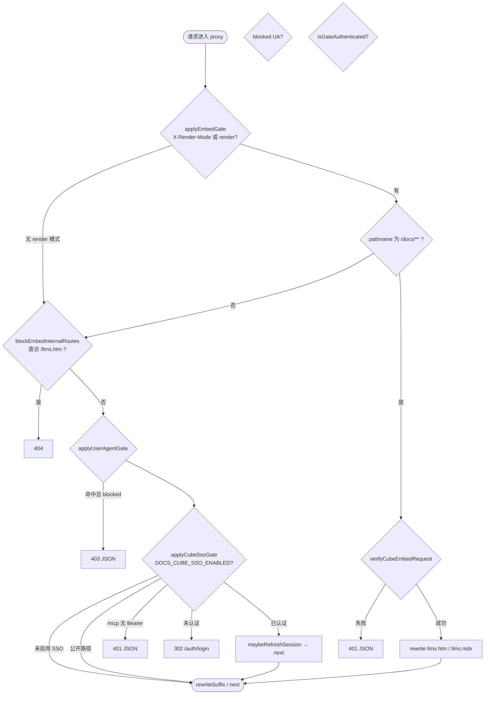
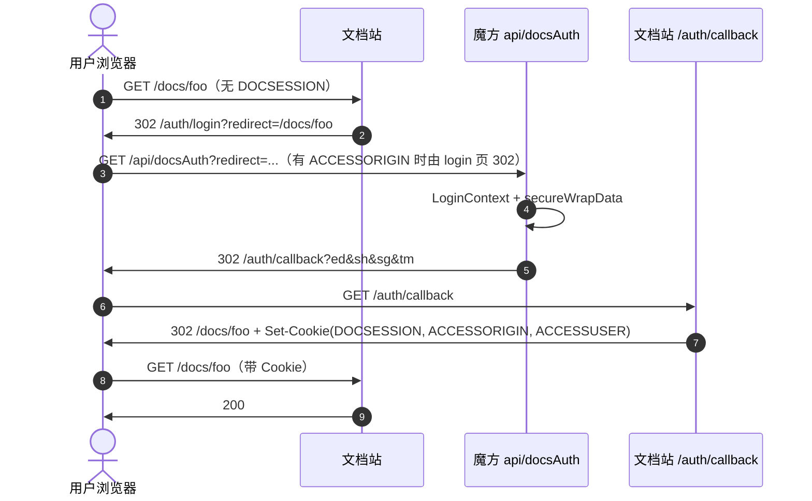
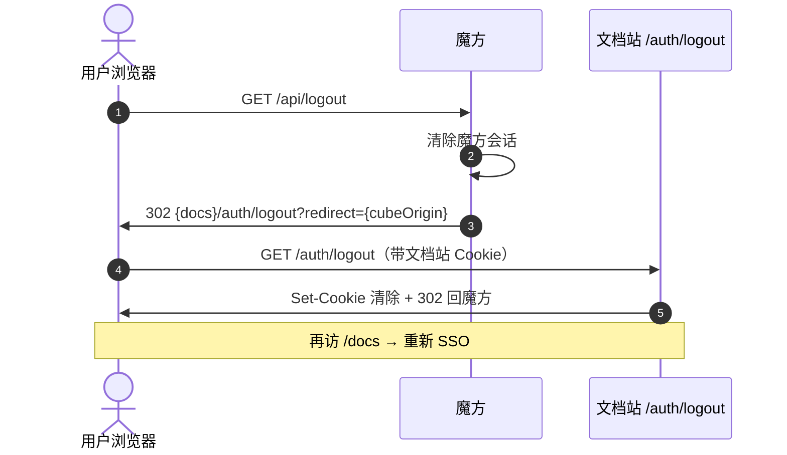
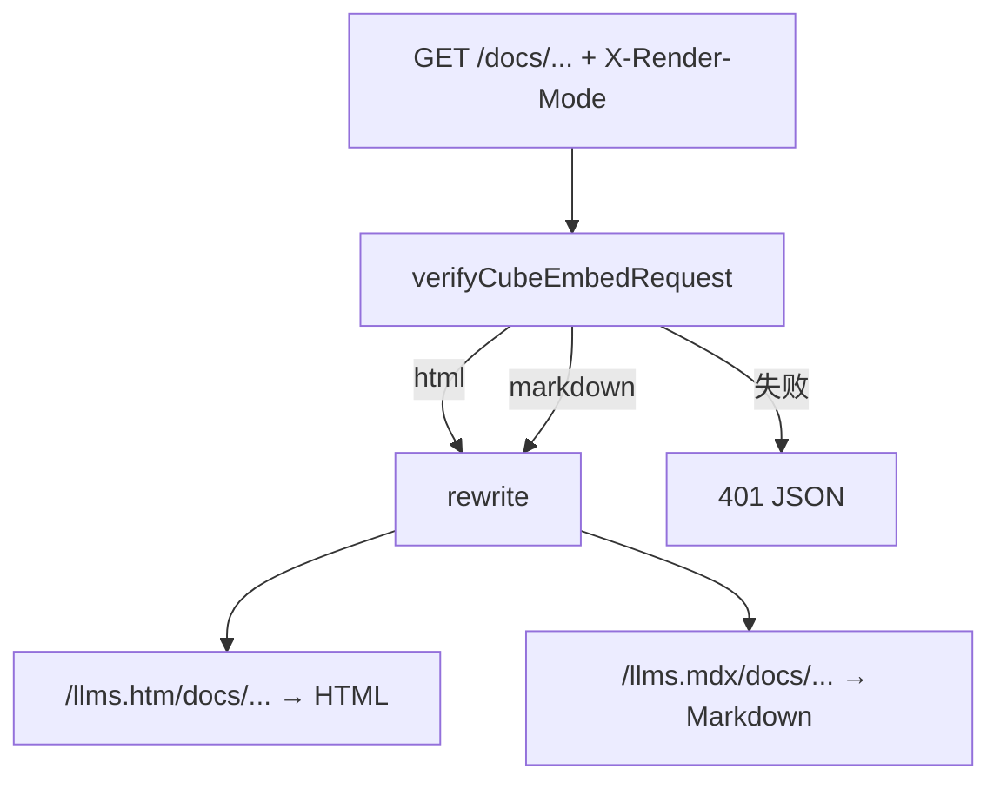
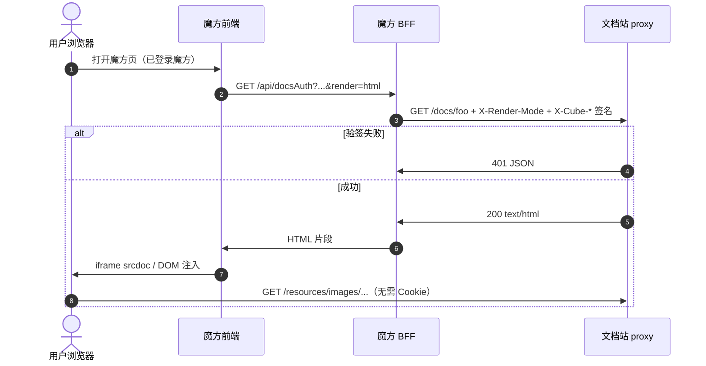

# Cube SSO 与文档站集成说明

魔方（Cube）与 RPA 公共知识库的对接契约。联调：`scripts/mock-cube-docs-auth.py`；验收：`scripts/verify-prod-gates.sh`。

---

## 1. 双通道一览

| 通道 | 场景 | 浏览器 Cookie | 魔方入口 |
|------|------|---------------|----------|
| **B** SSO 全页 | 新标签打开文档、MCP 浏览器登录 | 签发 `DOCSESSION` 等 | `GET /api/docsAuth?redirect=/docs/...` → 302 callback |
| **A** BFF 嵌入 | 魔方页 iframe / `srcdoc` | **不**写 Session | BFF 带 HMAC 请求文档站 `/docs/...`（`render=html\|markdown`） |

嵌入通道不写 Cookie；链式登出仅影响曾走通道 B 或 MCP 的浏览器会话。

---

## 2. 门禁规则

所有非静态请求经 [`src/proxy.ts`](../src/proxy.ts)，**顺序固定**，靠前规则优先返回。



### 2.1 公开路径（跳过 SSO Cookie 门禁）

- `/auth/**`、`/health`、`/_next/**`、`/.well-known/**`、`/oauth/**`
- `/resources/images/**` 及常见静态扩展名（图片/字体）

### 2.2 User-Agent 门禁

| 项 | 说明 |
|----|------|
| 开关 | `DOCS_USER_AGENT_GATE_ENABLED`；未设置时开发关闭、生产且 SSO 开启时默认开启 |
| 拦截 | `/`、`/docs/**`、`/mcp/deeplink`、`/resources/images/**` |
| 豁免 | `/auth/**`、`POST /mcp`、`/llms*`、`/skills/**`、`/api/**` 等 |
| 嵌入 BFF | `applyEmbedGate` 验签通过后直接返回，httpx 不走 UA 门禁 |
| 空 UA | 视为 blocked → `403 JSON` |

UA 可伪造，仅作前置成本；不可替代 HMAC / SSO。

### 2.3 SSO Cookie 门禁

`isGateAuthenticated` 为真当且仅当：

1. 有效 `DOCSESSION` 且未超过 `DOCS_SESSION_REAUTH_AFTER`（默认 7 天），或
2. 有效 MCP Bearer（`Authorization: Bearer`，aud 对齐 `NEXT_PUBLIC_SITE_URL`）

| 路径 | 未认证 |
|------|--------|
| `/docs/**` 等 | 302 `/auth/login?redirect=...` |
| `POST /mcp` | 401 JSON + `WWW-Authenticate: Bearer`（不 302） |

会话 TTL / 静默续期见 [`.env.example`](../.env.example)（`DOCS_SESSION_TTL`、`DOCS_SESSION_REAUTH_AFTER`）。

---

## 3. 认证与登出时序

### 3.1 SSO 全页（通道 B）



**Callback 签名（魔方 `secureWrapData` ↔ `/auth/callback`）**

```
ed = AES-ECB-PKCS7(payload JSON, App Secret) → Base64
sh = SHA256(App Secret) hex
sg = SHA256(ed + tm + App Secret) hex
tm = 毫秒时间戳（±3min，DOCS_SIGNATURE_WINDOW_MS）
```

| `ed` 字段 | 必须 | 说明 |
|-----------|------|------|
| `userName` | 是 | 写入 Session |
| `targetUrl` | 是 | 站内路径 `/...`，**禁止带 render** |
| `cubeOrigin` | 否 | 匹配 `DOCS_CUBE_ORIGIN_PATTERN` → `ACCESSORIGIN` |

### 3.2 链式登出

文档站 Cookie 在文档域；魔方退出后 **必须** 让浏览器 302 访问文档站 `/auth/logout`，禁止仅用 BFF httpx（无法清除浏览器 Cookie）。



| 要点 | 说明 |
|------|------|
| 魔方 | 清自身会话后 302：`/auth/logout?redirect=` + `encodeURIComponent(cubeOrigin)` |
| 文档站 | 清除 `DOCSESSION`、`ACCESSUSER`、`ACCESSORIGIN`、`DOCMCPTOKEN`、`fd_private_docs` |
| `redirect` | 魔方 origin 须在 `DOCS_CUBE_ORIGIN_PATTERN` 内，否则回退 `/auth/login` |

Mock 示例：`scripts/mock-cube-docs-auth.py` → `build_docs_logout_url`、`GET /logout`。

---

## 4. iframe 嵌入路径（通道 A）

- 魔方 **服务端** BFF 请求文档站；浏览器 **不** 在地址栏带 `sh/tm/sg`。
- 有 `X-Render-Mode` 或 Query `render=html|markdown`：先 HMAC 验签，失败 **401 JSON**（不 302 login），**无** `Set-Cookie`。
- 验签通过 → `canAccessPrivate: true`（等同 SSO 登录）。

### 4.1 文档站内路径



| 安全 | 说明 |
|------|------|
| 直访 `/llms.htm/docs/**` | 404（防伪造 `x-embed-verified-sh`） |
| 图片 | HTML 内 `{SITE_URL}/resources/images/...`，公开可读 |
| 私有页 | 验签通过即可读；可选 `X-Cube-User` 供后续 ACL |

### 4.2 BFF 凭证与签名

Header **优先**；缺省读 Query（与 callback 字段名对齐）。**嵌入签名 ≠ SSO callback 签名。**

| 语义 | Header（推荐） | Query |
|------|----------------|-------|
| Secret Hash | `X-Cube-Secret-Hash` | `sh` |
| 时间戳 | `X-Cube-Timestamp` | `tm` |
| 签名 | `X-Cube-Signature` | `sg` |
| 模式 | `X-Render-Mode` | `render` |
| 用户（可选） | `X-Cube-User` | `user` |

```
sg = SHA256(METHOD + "\n" + PATH + "\n" + TIMESTAMP + "\n" + APP_SECRET) → hex
```

`PATH` = `url.pathname`（不含 Query）。实现：[`src/lib/auth/cube-embed.ts`](../src/lib/auth/cube-embed.ts)。

### 4.3 魔方 → 前端（二选一）

| 方案 | 全页 | 嵌入 |
|------|------|------|
| **A** 扩展 `docsAuth` | `/api/docsAuth?redirect=/docs/...` | 同上 + `&render=html` |
| **B** 独立 `docsContent` | `/api/docsAuth?redirect=...` | `/api/docsContent?path=/docs/...&render=html` |

文档站对 A/B 处理相同；改动最小用 A，接口隔离用 B。

### 4.4 iframe 时序



---

## 5. 附录

### 5.1 魔方最小契约

| 接口 | 要点 |
|------|------|
| `GET /api/docsAuth?redirect=` | LoginContext；`secureWrapData` → 302 文档站 `/auth/callback` |
| `GET /api/logout` | 清魔方会话 → **302 浏览器** 文档站 `/auth/logout?redirect=` |
| 嵌入 BFF | `GET` 文档站 `/docs/...`，Header 带嵌入签名 + `X-Render-Mode` |
| `sh` / secrets | 与文档站 `DOCS_SECRETS_FILE` 一致（`sh = SHA256(secret)` hex） |

嵌入 401：密钥/时钟问题，勿 302 用户到文档站 login。404：无文档或无权限。

### 5.2 部署速查

| 变量 | 必需 |
|------|------|
| `DOCS_CUBE_SSO_ENABLED` | `true` |
| `DOCS_SESSION_SECRET` | 是 |
| `DOCS_SECRETS_FILE` | 是 |
| `NEXT_PUBLIC_SITE_URL` | 是（嵌入图片 URL、MCP aud） |
| `DOCS_CUBE_ORIGIN_PATTERN` | 推荐 |
| `DOCS_PRIVATE_ACCESS_TOKEN` | SSO 下勿配 |

Nginx：多枚 `Set-Cookie` 勿用 `$upstream_http_set_cookie` 单值覆盖；详见 [`nginx/docs.conf.example`](nginx/docs.conf.example)。推荐依赖 Next `proxy.ts` 做门禁。

### 5.3 代码索引

| 主题 | 路径 |
|------|------|
| 门禁总线 | `src/proxy.ts` |
| 嵌入验签 | `src/lib/auth/cube-embed.ts` |
| SSO callback | `src/app/auth/callback/route.ts` |
| 链式登出 | `src/app/auth/logout/route.ts` |
| 会话 / 清 Cookie | `src/lib/auth/session.ts`、`src/lib/auth/auth-core.ts` |
| 私有文档（含嵌入） | `src/lib/docs/access/doc-access.ts` |
| Mock 魔方 | `scripts/mock-cube-docs-auth.py` |
