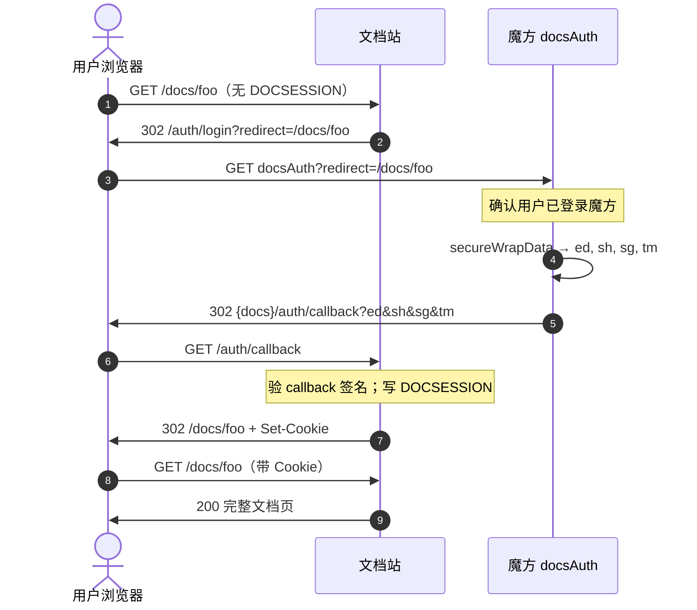
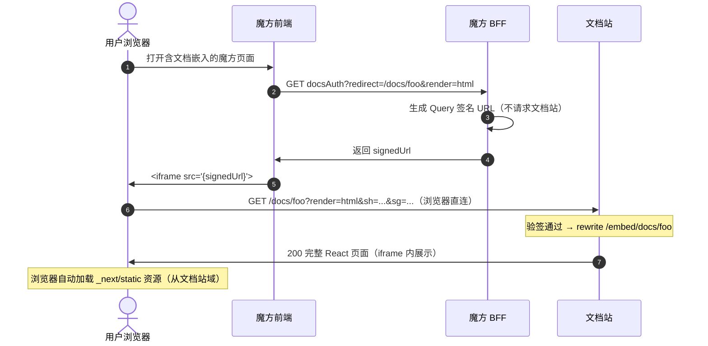
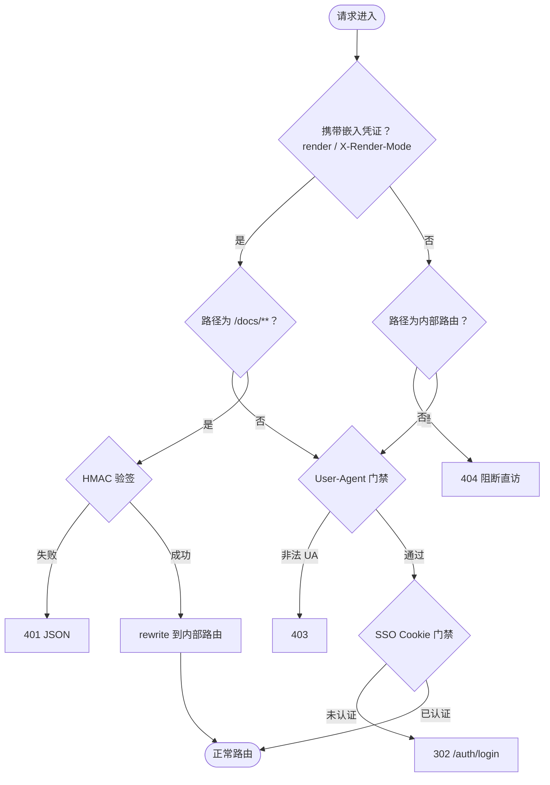

# 魔方 × 文档站集成说明

**本文是魔方（Cube BFF）侧的对接契约**，描述魔方需要实现哪些接口、各接口的职责边界、与文档站的交互方式和签名算法。

相关文件：

| 用途 | 路径 |
|------|------|
| 本地联调 Mock | `scripts/mock-cube-docs-auth.py` |
| 门禁验收脚本 | `scripts/verify-prod-gates.sh` |
| 文档站门禁实现 | `src/proxy.ts`、`src/lib/auth/cube-embed.ts` |

---

## 1. 两种使用场景

文档站有两种使用方式，对应不同的集成流程：

| 场景 | 描述 | 魔方需要实现 |
|------|------|------------|
| **全页浏览**（通道 B） | 用户在新标签打开完整文档站页面，有完整导航和 MCP 功能 | `docsAuth`（SSO 模式） + `logout` |
| **嵌入展示**（通道 A） | 在魔方页面内通过 `<iframe>` 嵌入文档内容，仅展示正文 | `docsAuth`（嵌入模式）或 `docsContent` + `docsResources`（按需） |

两种场景可以共存，魔方视需求选择实现哪些。

---

## 2. 场景一：全页浏览（SSO 登录）

### 2.1 流程

用户未登录文档站时，文档站会把用户重定向到魔方 `docsAuth`，魔方完成身份确认后，再把用户送回文档站完成登录。

```
用户浏览器 → 文档站 /docs/foo（无 Cookie）
→ 302 /auth/login?redirect=/docs/foo
→ 魔方 docsAuth?redirect=/docs/foo（无 render 参数）
→ 魔方验证登录态 → 302 文档站 /auth/callback?ed=...&sh=...&sg=...&tm=...
→ 文档站验签 → Set-Cookie(DOCSESSION) → 302 /docs/foo
→ 用户看到完整文档页
```



### 2.2 魔方 `docsAuth` 接口（SSO 模式）

**入参**：

| 参数 | 必须 | 说明 |
|------|------|------|
| `redirect` | 是 | 文档站内路径，以 `/` 开头，如 `/docs/connectors/foo` |

**不传 `render` 参数**（或 `render` 为空）时走此 SSO 分支。

**魔方侧处理**：

1. 验证用户已登录魔方（`LoginContext`）
2. 构造 `targetUrl = redirect`（**禁止在 targetUrl 中携带 `render` 参数**，否则文档站 callback 会拒绝）
3. 调用 `secureWrapData` 对 payload 加密，生成 `ed / sh / sg / tm`
4. 302 重定向到文档站 `/auth/callback?ed=...&sh=...&sg=...&tm=...`

**payload 字段**（AES-ECB-PKCS7 加密后的 JSON）：

| 字段 | 必须 | 说明 |
|------|------|------|
| `userName` | 是 | 写入 DOCSESSION，用于审计 |
| `targetUrl` | 是 | 登录成功后跳转，**不含** `render` |
| `cubeOrigin` | 否 | 魔方根 URL，需匹配 `DOCS_CUBE_ORIGIN_PATTERN` |

### 2.3 魔方 `logout` 接口（链式登出）

用户在魔方退出时，必须同时清除文档站的 Session Cookie，否则用户再次访问文档站时仍处于登录态。

**正确做法：302 浏览器到文档站登出**

```
用户点击退出 → 魔方清除自身会话
→ 302 {docs}/auth/logout?redirect={encodeURIComponent(cubeOrigin)}
→ 文档站清除 DOCSESSION 等 Cookie → 302 回魔方
```

> ⚠️ **禁止**用 BFF `httpx.get` 模拟请求文档站 `/auth/logout`，这样清不掉用户浏览器的 Cookie，必须让浏览器自己请求。

---

## 3. 场景二：嵌入展示

### 3.1 两种嵌入格式

| `render` | 内容格式 | 适合场景 |
|----------|---------|---------|
| `html` | 完整 React 页面（含交互组件） | iframe 展示，渲染效果与文档站一致 |
| `markdown` | 纯 Markdown 文本 | 喂给 AI 模型、程序处理 |

### 3.2 `render=html`（iframe 嵌入）的关键约束

> **`render=html` 返回的是完整 React SSR 页面，内含 `_next/static/...` 资源引用，这些路径指向文档站域。**
>
> 因此：
> - ❌ **不能** BFF 拉取 HTML 后用 `srcdoc` 填入 iframe
> - ❌ **不能** BFF 拉取 HTML 后透传给浏览器，再用 `iframe src=/docsContent` 加载
> - ✅ **必须** `iframe src` 直连文档站的签名 URL，让浏览器自己从文档站加载所有资源

**魔方正确的 `render=html` 接入方式**：

```
1. 魔方 BFF 生成文档站 Query 签名 URL（见 §4 签名算法）
2. BFF 将签名 URL 返回给前端
3. 前端：<iframe src="{signedUrl}">
```

```
signedUrl = https://docs.example.com/docs/foo
  ?render=html
  &sh={SHA256(App Secret)}
  &tm={毫秒时间戳}
  &sg={SHA256("GET\n/docs/foo\n{tm}\n{App Secret}")}
  &user={当前用户名}          ← 可选
  &cubeOrigin={魔方根 URL}    ← 必填，用于文档鉴权
```

`render=markdown` 无此限制，BFF 代理（Header 或 Query 签名）均可。

### 3.3 魔方嵌入接口：`docsAuth`（嵌入模式）

在已有 `docsAuth` 接口上，通过 `render` 参数区分 SSO 和嵌入。

**入参**：

| 参数 | 必须 | 说明 |
|------|------|------|
| `redirect` | 是 | 文档站内路径，如 `/docs/connectors/foo` |
| `render` | 是 | `html` 或 `markdown` |

**魔方侧处理（render=html）**：

1. 验证用户已登录魔方
2. **生成文档站 Query 签名 URL**（不拉取 HTML）
3. 将签名 URL 返回给前端
4. 前端用 `<iframe src="{signedUrl}">` 加载

**魔方侧处理（render=markdown）**：

1. 验证用户已登录魔方
2. BFF 服务端请求文档站，携带嵌入签名（见 §4.2）
3. 将返回的 Markdown 文本透传给前端



### 3.4 魔方嵌入接口：`docsContent`（可选，方案 B）

如果魔方希望将嵌入与 SSO 解耦，可以提供独立的 `docsContent` 接口，职责单一：只负责嵌入文档。

**入参**：

| 参数 | 必须 | 说明 |
|------|------|------|
| `path` | 是 | 文档站内路径，如 `/docs/connectors/foo` |
| `render` | 是 | `html` 或 `markdown` |

行为与 `docsAuth?render=` 完全相同：

- `render=html`：生成并返回 Query 签名 URL，前端 `iframe src` 直连
- `render=markdown`：BFF 拉取后透传文本

### 3.5 `docsResources` 图片代理（仅 render=markdown 需要）

> **`render=html` 不需要 `docsResources`**：React 页面内的图片走文档站标准路径，浏览器直接从文档站加载。
>
> `docsResources` 仅在 `render=markdown` 时有意义——当 Markdown 内容中的图片需要受登录保护时，由魔方代理回源。

**接口行为**：

| 参数 | 必须 | 说明 |
|------|------|------|
| `path` | 是 | 相对路径，如 `public/images/qianniu/foo.png`（不含 `/resources/images` 前缀） |

**魔方侧处理**：

1. 验证用户已登录魔方（主防线，防止裸链暴露）
2. 规范化 `path`：禁止 `..`，扩展名白名单（`png|jpg|jpeg|gif|webp|svg`）
3. BFF 回源文档站（见 §4.2，`PATH = /resources/images/{path}`）
4. 返回图片，设置 `Cache-Control: private, no-store`

---

## 4. 签名算法

### 4.1 SSO Callback 签名（通道 B）

用于 `docsAuth` SSO → 文档站 `/auth/callback`。

```
sh = SHA256(App Secret)  ← hex，标识密钥，不传明文
ed = AES-ECB-PKCS7(payload JSON, App Secret) → Base64
tm = 当前毫秒时间戳
sg = SHA256(ed + tm + App Secret)  ← hex
```

文档站 callback 地址：`{docs}/auth/callback?ed={ed}&sh={sh}&sg={sg}&tm={tm}`

**时效**：±3 分钟（`DOCS_SIGNATURE_WINDOW_MS`，默认 180000ms）。

### 4.2 嵌入 HMAC 签名（通道 A）

用于所有嵌入请求：拉取文档正文、回源图片。

```
sh = SHA256(App Secret)  ← hex
tm = 当前毫秒时间戳（ms）
sg = SHA256(METHOD + "\n" + PATH + "\n" + tm + "\n" + App Secret)  ← hex
```

**`PATH` 规则**（签名用 pathname，不含 Query）：

| 请求类型 | PATH 示例 |
|---------|----------|
| 拉文档正文 | `/docs/connectors/foo` |
| 回源图片 | `/resources/images/public/images/qianniu/foo.png` |

**传参方式**（Header 优先，Query 备用）：

| 语义 | Header（推荐） | Query |
|------|----------------|-------|
| Secret Hash | `X-Cube-Secret-Hash` | `sh` |
| 时间戳 | `X-Cube-Timestamp` | `tm` |
| 签名 | `X-Cube-Signature` | `sg` |
| 渲染模式 | `X-Render-Mode` | `render` |
| 用户（可选） | `X-Cube-User` | `user` |
| 魔方根 URL | `X-Cube-Origin` | `cubeOrigin` |

> `X-Cube-Origin`（`cubeOrigin`）**必填**：文档站用此字段校验来源合法性。值为魔方站点根 URL，如 `https://cube.example.com`，需匹配文档站 `DOCS_CUBE_ORIGIN_PATTERN`。

**时效**：±3 分钟（与 Callback 签名共用 window）。

### 4.3 密钥管理

- `sh = SHA256(App Secret)` 是 App Secret 的哈希，用于文档站识别密钥，不传明文
- 文档站配置 `DOCS_SECRETS_FILE_PATH`，格式：`{ "sh_hex": "plain_secret" }`
- 魔方与文档站约定同一份密钥文件，保持 `sh` 一致

---

## 5. 文档站门禁说明（魔方无需关心，仅供参考）

所有进入文档站的请求按以下顺序过检：



嵌入请求（验签通过）在第一关就完成，不再经过 UA 门禁和 SSO Cookie 门禁。

---

## 6. 部署配置

### 6.0 推荐：单分支双实例

生产环境推荐从 **`main` 分支**构建同一 Dockerfile，用**两个独立 Docker 实例** + 不同 `.env` 区分：

- **内网文档**（如 `:3033`）：`DOCS_CUBE_SSO_ENABLED=false`
- **知识库 SSO**（如 `:3031`，`knowledge.yuce-tech.cn` 反代）：`DOCS_CUBE_SSO_ENABLED=true`，配置 `DOCS_SECRETS_FILE_PATH`

同机部署时须设置不同的 `COMPOSE_IMAGE`、`COMPOSE_CONTAINER_NAME`、`PORT`（详见仓库 `README.md`）。宿主机用 `./scripts/manage-secrets.sh` 维护嵌入密钥 JSON。

> 从 `knowledge-sso` 分支迁移时：先让 3031 实例改拉 `main` 并验收，稳定后再归档旧分支；迁移完成前可保留旧分支作回滚。

### 6.1 文档站环境变量

| 变量 | 说明 | 生产建议 |
|------|------|---------|
| `DOCS_CUBE_SSO_ENABLED` | 启用 SSO + 嵌入鉴权 | `true` |
| `DOCS_SESSION_SECRET` | Session 加密密钥 | 强随机，必填 |
| `DOCS_SECRETS_FILE_PATH` | 宿主机 secrets 文件路径（Compose 挂载至容器 `/opt/secrets/secrets.json`） | SSO 实例必填；用 `scripts/manage-secrets.sh` 维护 |
| `NEXT_PUBLIC_SITE_URL` | 文档站 canonical URL | 必填，用于 MCP aud 和回源基址 |
| `DOCS_CUBE_ORIGIN_PATTERN` | 约束 cubeOrigin 合法值（正则） | 如 `^https://cube\.example\.com$` |
| `DOCS_RESOURCES_REQUIRE_EMBED_SIGN` | 图片资源是否强制验签 | 默认：生产且 SSO 开启时为 `true` |
| `DOCS_PRIVATE_ACCESS_TOKEN` | Bearer Token 访问私有文档 | SSO 模式下勿配 |

### 6.2 本地联调

```bash
# 终端 1：启动文档站（SSO 模式）
DOCS_CUBE_SSO_ENABLED=true npm run dev

# 终端 2：启动 Mock 魔方（默认端口 8765）
python3 scripts/mock-cube-docs-auth.py

# 运行验收检查
./scripts/verify-prod-gates.sh
```

| 场景 | 联调地址 |
|------|---------|
| SSO 全页登录 | `http://127.0.0.1:8765/docsAuth?redirect=/docs` |
| iframe 嵌入测试页 | `http://127.0.0.1:8765/iframe-test` |
| 嵌入 HTML（方案 A） | `http://127.0.0.1:8765/docsAuth?redirect=/docs/connectors/foo&render=html` |
| 嵌入 Markdown（方案 A） | `http://127.0.0.1:8765/docsAuth?redirect=/docs/connectors/foo&render=markdown` |
| 嵌入 HTML（方案 B） | `http://127.0.0.1:8765/docsContent?path=/docs/connectors/foo&render=html` |
| 图片代理 | `http://127.0.0.1:8765/docsResources?path=public/images/qianniu/foo.png` |
| 链式登出 | `http://127.0.0.1:8765/logout` |

---

## 7. 魔方接入检查清单

实现完成后逐项确认：

**SSO 全页（通道 B）**
- [ ] `docsAuth`（无 `render`）：验证魔方登录态 → `secureWrapData` → 302 callback
- [ ] callback `targetUrl` **禁止**携带 `render` 参数
- [ ] `cubeOrigin` 与文档站 `DOCS_CUBE_ORIGIN_PATTERN` 匹配
- [ ] `logout`：302 浏览器到 `{docs}/auth/logout?redirect={cubeOrigin}`（不用 BFF httpx 请求）

**嵌入展示（通道 A）**
- [ ] `render=html`：**只生成 Query 签名 URL，不拉取 HTML**，返回给前端用 `iframe src` 加载
- [ ] `render=markdown`：BFF 服务端拉取，Header 方式传嵌入凭证
- [ ] 所有嵌入请求**必须携带** `X-Cube-Origin`（Header）或 `cubeOrigin`（Query）
- [ ] 嵌入失败时（401 JSON）：不 302 到文档站登录页，直接向前端报错

**密钥与安全**
- [ ] `sh = SHA256(App Secret)` 与文档站 `DOCS_SECRETS_FILE_PATH` 一致
- [ ] 生产环境嵌入凭证走 Header，不走 Query（避免进日志）
- [ ] 签名 `PATH` 为 pathname（不含 `?` 后的 Query 部分）

---

## 8. 常见错误排查

| 现象 | 可能原因 | 解决 |
|------|---------|------|
| 嵌入返回 401 | `sh` 不一致、时钟偏差 >3 分钟、签名 PATH 错误 | 检查密钥文件；对齐 NTP；确认 PATH 是纯 pathname |
| iframe 内 JS 报错、页面空白 | `render=html` 用了 BFF 代理 / srcdoc | 改用 `iframe src` 直连文档站签名 URL |
| 嵌入图片不显示 | 未传 `X-Cube-Origin` 或 pattern 不匹配 | 补全 Header；检查 `DOCS_CUBE_ORIGIN_PATTERN` |
| 图片资源 401 | 回源签名 PATH 未用完整资源路径 | 签名 PATH = `/resources/images/...` |
| SSO 登录后跳错页 | `targetUrl` 含 `render=` | 清除 targetUrl 中的 render 参数 |
| 退出后文档站仍有 Session | `logout` 用 BFF 请求而非浏览器 302 | 改为 302 浏览器到 `/auth/logout` |

---

## 9. 代码索引（文档站侧）

| 主题 | 路径 |
|------|------|
| 门禁总线 | `src/proxy.ts` |
| 嵌入验签 | `src/lib/auth/cube-embed.ts` |
| 图片资源 HMAC | `src/lib/auth/sign-resource.ts` |
| SSO callback | `src/app/auth/callback/route.ts` |
| 链式登出 | `src/app/auth/logout/route.ts` |
| 嵌入 HTML 路由 | `src/app/embed/docs/[[...slug]]/page.tsx` |
| 嵌入 Markdown 路由 | `src/app/llms.mdx/docs/[[...slug]]/route.ts` |
| 图片资源路由 | `src/app/resources/images/[...path]/route.ts` |
| 私有文档 ACL | `src/lib/docs/access/doc-access.ts` |
| Mock 三接口 | `scripts/mock-cube-docs-auth.py` |
