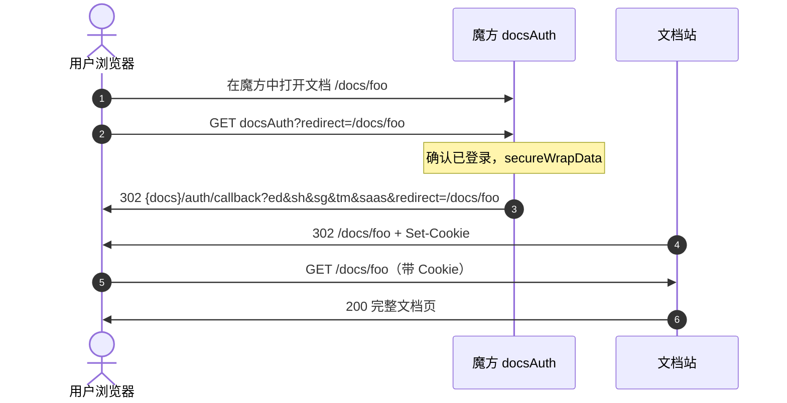
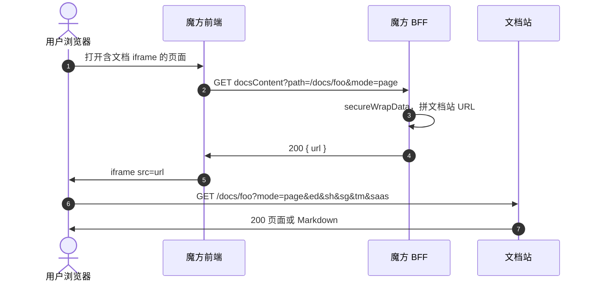
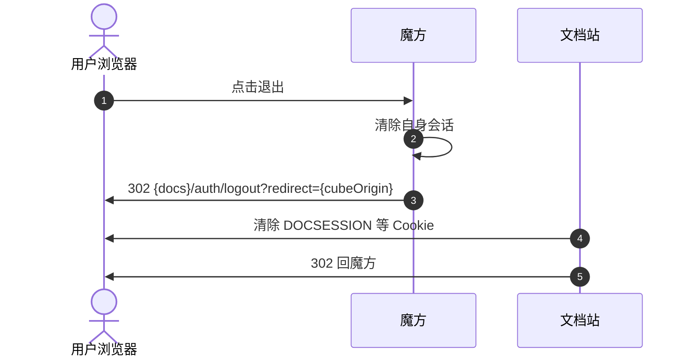

# 魔方 × 文档站集成说明

确认用户已登录魔方后，签发登录包，**拼成文档站 URL，交给浏览器访问**

---

## 1. 魔方接口与文档站接口


| 场景       | 魔方接口                           | 文档站接口                                                                       |
| -------- | ------------------------------ | ---------------------------------------------------------------------------------- |
| **跳转文档站** | `GET {cube}/api/docsAuth`      | `GET {docs}/auth/callback`                                                     |
| **嵌入内容** | `GET {cube}/api/docsContent`   | `GET {docs}{path}`                                                               |
| **链式登出** | 魔方退出时 302                   | `GET {docs}/auth/logout`                                                         |


`docsAuth` 302 跳转

登录包字段：

```
sh = SHA256(App Secret)                         hex，不传明文密钥
ed = AES-ECB-PKCS7(payload JSON, App Secret)    Base64
tm = 当前毫秒时间戳
sg = SHA256(ed + tm + App Secret)               hex
```

`tm` 到达文档站时须在 ±3 分钟内（`DOCS_SIGNATURE_WINDOW_MS`，默认 180000）
---

## 2. 跳转文档站（302）

**魔方接口：** `GET {cube}/api/docsAuth?redirect=/docs/foo`

**文档站接口：** `GET {docs}/auth/callback`

| Query        | 必须  | 说明                                          |
| ------------ | --- | ------------------------------------------- |
| `ed`         | 是   | 登录包，见 §1                                    |
| `sh`         | 是   | 登录包                                         |
| `sg`         | 是   | 登录包                                         |
| `tm`         | 是   | 登录包                                         |
| `saas`       | 否   | 与 `ed`/`sh`/`sg`/`tm` 并列，转成用户中心 `isSaas`。暂时可选以兼容老链接。只认 `true` / `false`，不传、空串或其它值都是 `false` |
| `redirect`   | 建议  | 登录成功后的落点，URL encode，未带则落到 `/docs` |


拼给浏览器的完整 URL：

```
GET {docs}/auth/callback?ed={ed}&sh={sh}&sg={sg}&tm={tm}&saas={true|false}&redirect={encodeURIComponent(redirect)}
```


---

## 3. 嵌入内容

**魔方接口：** `GET {cube}/api/docsContent?path=/docs/foo&mode=page|llms`

| Query  | 必须  | 说明                                       |
| ------ | --- | ---------------------------------------- |
| `path` | 是   | 文档站内路径，例如 `/docs/rpa/RPA_QIANNIU/foo` |
| `mode` | 是   | `page`（React 页）或 `llms`（Markdown / `/llms.mdx` 链路） |


魔方后端确认已登录后签发登录包，**拼接文档站 URL**，前端：

```
<iframe src="{url}" />
```

**文档站接口：** `GET {docs}{path}`（`path` 即上面的文档路径，不是 `/llms.mdx`）


| Query  | 必须  | 说明                         |
| ------ | --- | -------------------------- |
| `mode` | 是   | `page` 或 `llms`            |
| `ed`   | 是   | 登录包，见 §1                   |
| `sh`   | 是   | 登录包                        |
| `sg`   | 是   | 登录包                        |
| `tm`   | 是   | 登录包                        |
| `saas` | 否   | 与 `ed`/`sh`/`sg`/`tm` 并列，转成用户中心 `isSaas`。暂时可选以兼容老链接。只认 `true` / `false`，不传、空串或其它值都是 `false` |


拼给 iframe 的完整 URL（两种 `mode` 只差这一个参数）：

```
GET {docs}{path}?mode={page|llms}&ed={ed}&sh={sh}&tm={tm}&sg={sg}&saas={true|false}
```

`mode=page` 返回完整 SSR 页面，`/_next/static/...` 指向文档站域名，因此：

- 不能由 BFF 拉 HTML 再塞进 `srcdoc`
- 不能让 iframe 去加载魔方自己的 `/docsContent`
- 必须浏览器直连文档站



`mode=llms` 时序相同，只是 `mode=llms`，响应为 Markdown。正文配图：

**文档站接口：** `GET {docs}/resources/images/{path}?sign={token}`

浏览器直连该 URL；过期或篡改返回 401。魔方不要再代理图片。

嵌入失败时文档站返回 **401 JSON**，**不会** 302 到登录页。iframe 内按接口错误展示即可。

---

## 4. 链式登出

魔方退出时建议让**浏览器**访问文档站登出，否则文档站 Cookie 仍在。

**文档站接口：** `GET {docs}/auth/logout`


| Query      | 必须  | 说明                                                                 |
| ---------- | --- | ------------------------------------------------------------------ |
| `redirect` | 是   | 魔方根 URL（或带路径的魔方地址），须 URL encode，且匹配 `DOCS_CUBE_ORIGIN_PATTERN` |


```
GET {docs}/auth/logout?redirect={encodeURIComponent(cubeOrigin)}
```

禁止用 BFF `httpx.get` 代发：清不掉用户浏览器里的 Cookie。



---

## 5. 文档站对外行为


| 请求                                                         | 未通过                          | 通过                                    |
| ---------------------------------------------------------- | --------------------------- | ------------------------------------- |
| `GET {docs}/docs/**`（无 `mode`）                             | 302 `{docs}/auth/login?...` | 200 完整页面（需已有 `DOCSESSION`）            |
| `GET {docs}{path}?mode=page\|llms&ed&sh&tm&sg&saas`        | **401 JSON**，不跳登录页          | 200：page 为 React 页，llms 为 Markdown    |
| `GET {docs}/resources/images/**?sign=`（生产 SSO 默认强制校验）      | 401                         | 200 图片                                |


---

## 6. 接入检查清单

**全页**

- [ ] `docsAuth` 无 `mode`：已登录 → 302 `{docs}/auth/callback?ed&sh&sg&tm&saas&redirect=...`
- [ ] `redirect` 与 payload.`targetUrl` 均不含 `mode=`
- [ ] `logout`：浏览器 302 `{docs}/auth/logout?redirect={cubeOrigin}`

**嵌入**

- [ ] `docsContent` 只拼 URL 给前端，不拉文档站正文
- [ ] 前端 `iframe src` 直连 `{docs}{path}?mode=&ed=&sh=&tm=&sg=&saas=`
- [ ] **不发** `X-Cube-*` / `X-Docs-Mode` Header
- [ ] Query **不带** `user` / `cubeOrigin`
- [ ] 收到 401 时不跳文档站登录页
- [ ] **不要实现 docsResources**；图走 `?sign=` 直链

**密钥**

- [ ] App Secret 与用户中心侧租户配置一致

---

## 7. 常见问题


| 现象             | 原因与处理                                                    |
| -------------- | -------------------------------------------------------- |
| 嵌入 401         | 缺 `ed`、四参数不齐、`sg` 公式不对、时钟偏差超过 ±3 分钟，直接拒绝，不回退。用户中心未配置、未就绪或请求失败时，回退到用 `secrets.json` 验证和解密登录包 |
| iframe 空白或脚本报错 | BFF 代理了 HTML / 放进了 `srcdoc` / iframe 指向了魔方 `/docsContent`。 |
| llms 配图 401    | `sign` 过期或被改写。重新打开嵌入页获取新签名。                                |
| SSO 后跳错页       | `redirect` 含 `mode=`，或 callback 未带明文 `redirect`。          |
| 退出后文档站仍登录      | `logout` 被 BFF 代发。改为浏览器 302 `/auth/logout`。              |


---

## 8. 本地联调

```bash
DOCS_CUBE_SSO_ENABLED=true DOCS_USER_CENTRE_BASE_URL=http://127.0.0.1:8765 npm run dev
python3 scripts/mock-cube-docs-auth.py
```


| 场景         | 地址                                                                                                                                 |
| ---------- | ---------------------------------------------------------------------------------------------------------------------------------- |
| SSO 全页     | `http://127.0.0.1:8765/docsAuth?redirect=/docs`                                                                                    |
| iframe 测试页 | `http://127.0.0.1:8765/iframe-test`                                                                                                |
| 嵌入 page    | `http://127.0.0.1:8765/docsContent?path=/docs/rpa/RPA_QIANNIU/rpa-conn-qianniu-item-quality-score-list&mode=page`                  |
| 嵌入 llms    | `http://127.0.0.1:8765/docsContent?path=/docs/rpa/RPA_QIANNIU/rpa-conn-qianniu-item-quality-score-list&mode=llms`                  |
| 链式登出       | `http://127.0.0.1:8765/logout`                                                                                                     |
